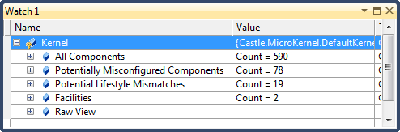
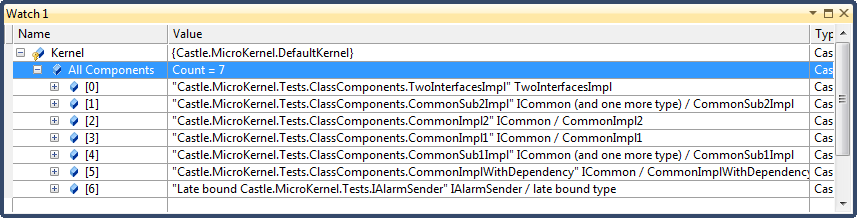
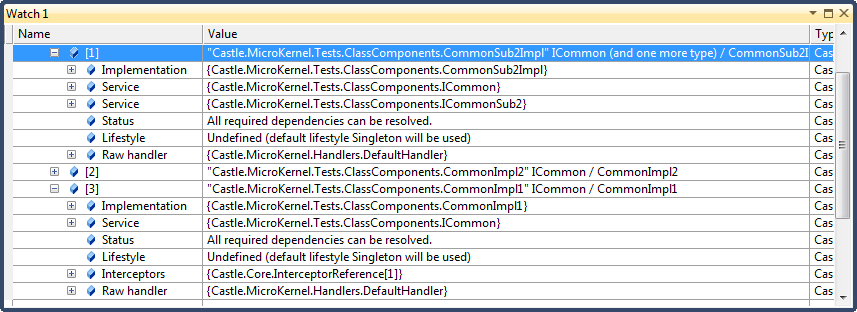
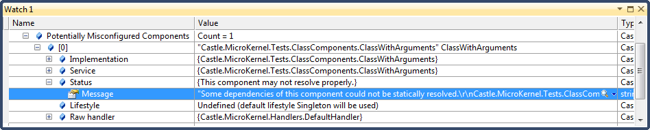
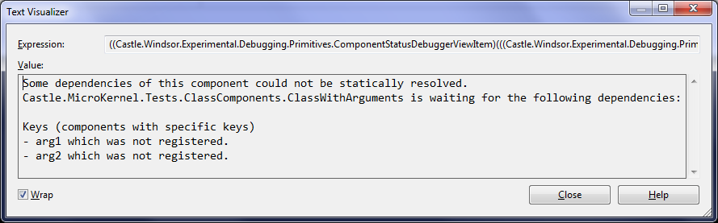
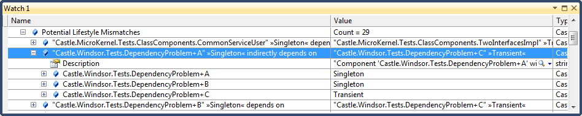
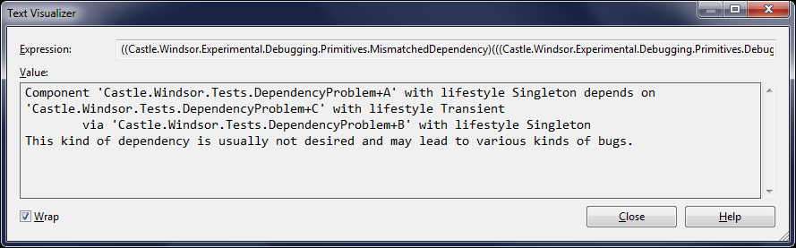

# Debugger Views

To make it easier to gain insight into what's happening in the container, and bring potential issues to your attention Windsor provides a customisable, dynamic debugger view on top of the container.

To access them, put a breakpoint on a piece of code where your container is in scope and view the container using built in Visual Studio windows, like Locals or a watch window. You can bring it up by clicking on the container when your breakpoint has been hit, and selecting "Add Watch" from the context menu.



As of version 2.5.1 Windsor gives you the following four items in the list, when you view your container in the Visual Studio debugger.

## All components

As the name implies this option gives you all of the components that are registered in your container.



For each component the information you see has the following format:

```
unique name of the component in the container" service type (and optional count of other services) / optionally implementation type
```

### unique name

The first element - the name is the unique key by which Windsor identifies the component. If you use `Named()` method of the fluent API to give a name to your component, or register the component from XML with `id` attribute, that would be it. If you don't set a name explicitly (which would be most of the time) Windsor will assign a key itself (most of the time this will be the name of the implementation type, but it does not have to be, so **you should not rely on it**).

### service type

Service type is the type of the service exposed by your component and is likely the most important piece of information available at this level. If your component exposes more than one service, one of them will be shown at this level along with how many other services are exposed (for example, see second component from the top on the above screenshot).

### implementation type

In most cases your component implementation type will also be shown after `/` as the last piece of information. This won't be shown if your component's service is the implementation type (i.e. you expose your class as itself rather than one of the interfaces it implements or its base type). If the implementation type is not there, as in the case of the very first component in the screenshot above, it means that the type we see, `TwoInterfacesImpl` in this case, is both the implementation and the service type).

:information_source: **late bound type:** If you look at the last component in the screenshot above, you'll notice that its implementation type is listed as "late bound type". This means that this component is most likely created via a factory, such as `UsingFactoryMethod` method), and Windsor cannot statically determine the actual implementation type.

## Component view

When you expand any of the components on the list you will see view similar to the following:



The exact list of elements may be different from component to component but it contains the following elements:

* Implementation type
* Service types exposed by the component (all of them)
* Status (can Windsor's static analysis find all dependencies required to create the component's instance) (discussed in more details below)
* Lifestyle of the component
* Interceptors list (if any, otherwise not present)
* Raw handler (gives you access to low level information about the component)

## Potentially Misconfigured Components

Potentially Misconfigured Components list gives you list of components that Windsor thinks may have been misconfigured. That means that they have some dependencies that are required but Windsor was not able to statically determine if they can be provided.

:warning: **This is not 100% accurate:** This is just a helper, Windsor raising a flag saying that something may not be right. However if a component shows up on this list it does not mean that it can't be resolved. The opposite is also true.



If you want to know more about why Windsor thinks a component is misconfigured, go to its `Status -> Message` property and open it with standard Text Visualizer. Provided the component class looks like this...

```csharp
public class ClassWithArguments
{
    private readonly string arg1;
    private readonly int arg2;

    public ClassWithArguments(string arg1, int arg2)
    {
        this.arg1 = arg1;
        this.arg2 = arg2;
    }
}
```

...and its arguments weren't provided, Windsor will give you a nice description like the following:



## Potential Lifestyle Mismatches

Rule of thumb is that short lived component should reference long lived components, not the other way around. So if you have a singleton that references a per-web-request component, thus keeping it alive longer than for the timespan of the web request, you most likely have a bug. Windsor detects dependencies like that and reports them in the Potential Lifestyle Mismatches list. Currently the following dependencies are detected out of the box:

* singleton depending on a transient
* singleton depending on a per-web-request

:warning: **This is not 100% accurate:** Again, this is a list of **potential** lifestyle mismatches and in some rare cases this may be a valid scenario (especially with singleton depending on a transient).

The list shows information in the following format:

```
"depending component's unique name" »lifestyle« (directly/indirectly) depends on | "depenent component's unique name" »lifestyle«
```



When you expand the `Description` property you will see the full description of the dependency chain.



:information_source: **Indirect dependencies:** Notice that in the example above the dependency goes as follows: `A (singleton) -> B (singleton) -> C (transient)` so `A` depends on `C` indirectly, via `B`. This is reflected in the list of components which shows how the dependency chain goes (top to bottom) as well as description message.

## Access debugger information from code

If you want to access the debugger information from code (i.e. from tests), then you can obtain potentially misconfigured handlers in this way:

```csharp
var host = (IDiagnosticsHost)container.Kernel.GetSubSystem(SubSystemConstants.DiagnosticsKey);
var diagnostics = host.GetDiagnostic<IPotentiallyMisconfiguredComponentsDiagnostic>();
var misconfiguredHandlers = diagnostics.Inspect();
```

Instead of `IPotentiallyMisconfiguredComponentsDiagnostic`, you can use `IPotentialLifestyleMismatchesDiagnostic` interface.