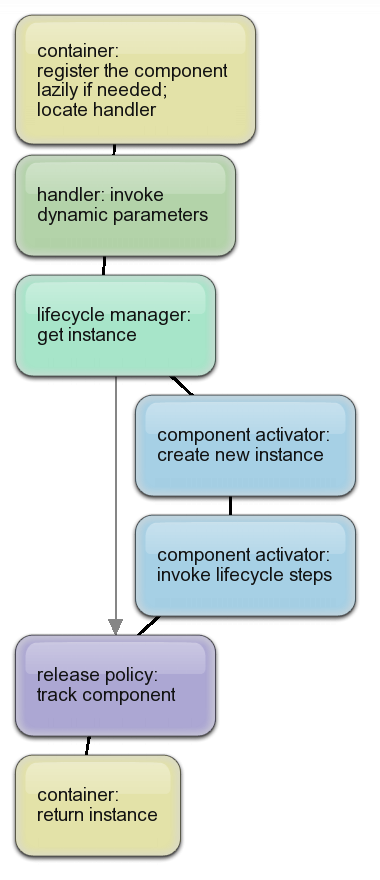

# How components are created

When a component is requested from Windsor container, the container goes through several steps in order to provide the instance. The image on the right depicts the more important aspects of these steps. We'll discuss them here in more detail.

:information_source: **On instance lifecycle and lifestyle:** This page serves two-fold purpose. First it explains what Windsor does when an instance of a [component](services-and-components.md) is requested **regardless of the component's [lifestyle](lifestyles.md)**. In addition to that, it describes the first part of the component's lifecycle, that is its inception and birth (or in technical terms, what leads to instance being created, and how it's being created). Please do keep in mind that is not the entire lifecycle of an instance, it's just the first step. To learn about the whole lifecycle, all the way to component's death see the page about [instance lifecycle](lifecycle.md)

## Locating handler

The first step performed by the container when a component is requested is to check whether the requested component was registered with the container. The container asks its [naming subsystem](subsystems.md) for the component, and if the component could not be found, the container will try to [Lazy-Component-Loaders|register it lazily], and if that does not succeed, a `ComponentNotFoundException` will be thrown.

Assuming the correct component can be found, the container will poll its [handler](handlers.md) and ask it to resolve the component instance.

## What handler does

Handler does a few things:

* It invokes all `ComponentResolvingDelegate`s associated with it, giving them a chance to affect resolution before it actually starts. That's for example when [delegates passed to DynamicParameters method](inline-dependencies.md#supplying-dynamic-dependencies) of [fluent registration API](fluent-registration-api.md) are invoked.
* When no in-line arguments were provided, it checks whether the component and all its mandatory dependencies can be resolved. If not, a `HandlerException` is thrown.
* Otherwise, handler asks its [lifestyle manager](lifestyles.md) to resolve the component.

## What lifestyle manager does

Lifestyle manager has relatively simple role. If it has a component instance it can reuse, it gets it and returns the instance immediately back to the handler. If not, it asks [its component activator](component-activators) to create one for it.

## What component activator does

:information_source: **Component activators:** Component activator is responsible for creating the instance of the component. Various activators have various ways of achieving that. When you create your component via `UsingFactoryMethod` the delegate you provided will be invoked to create the instance. [Factory Support Facility](factory-support-facility.md) or [Remoting Facility](remoting-facility.md) have their own set of activators that perform custom initialization of the components.}

Most of the time you will be using `DefaultComponentActivator` which does the following:

* Instantiates the component by invoking its constructor. :information_source: **How constructor is selected:** To learn how default component activator selects constructor to use [see here](how-constructor-is-selected.md).
* When the instance is created, it then resolves component's property dependencies. :information_source: **How properties are injected:** To learn how default component activator injects dependencies into properties [see here](how-properties-are-injected.md).
* When the component is fully created it invokes all [commission concerns](lifecycle.md) of the component.
* Triggers `ComponentCreated` event on the kernel.
* Returns the instance back to lifestyle manager.

## What handler, release policy and container do

Lifestyle manager may save the instance to some contextual cache if needed, so that it can be later reused, and passes it down to the handler. Handler optionally asks [release policy](release-policy.md) to track the component, if it's allowed and required, and then passes it down to the container, which returns it to the user.

## See also

* [How dependencies are resolved](how-dependencies-are-resolved.md)
