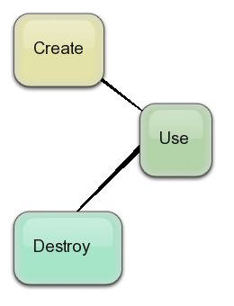

# Lifecycle

## Introduction

Simplified lifecycle of components:



Broadly speaking Windsor is a tool that controls creation and destructions of components. From the ten thousand foot view, the component's lifecycle consists of three steps:

* creation - everything that happens within `container.Resolve` or similar method (see [How components are created](how-components-are-created.md) for more details).
* usage - whatever you do with the component in your code
* destruction - everything that happens within and/or after `container.ReleaseComponent` or when the component's lifetime scope is ending.

Windsor lets you plug into the lifecycle pipeline (creation and destruction) and invoke some additional logic, either external, or internal to the component by using lifecycle concerns (objects implementing one of two`ILifecycleConcern`-derived interfaces).

## Creation - commission concerns

Lifecycle concerns executed during creation of the component are called commission concerns. Implementation-wise they all implement the `ICommissionConcern` interface. They get executed after the component is instantiated and all of its dependencies are wired up. There are several standard ways of hooking a commission concern to the component.

### The `OnCreate` method

When you register your component using the [fluent registration API](fluent-registration-api.md) you can use its [`OnCreate`](fluent-registration-api.md#oncreate) method to hook additional logic, that will be executed as a commission concern.

```csharp
container.Register(
   Component.For<IService>()
      .ImplementedBy<MyService>()
      .OnCreate((kernel, instance) => instance.Timestamp = DateTime.UtcNow)
   );
```

### The `IInitializable` interface

There are a couple of interfaces that when implemented by your components, receive special treatment from Windsor.
One of them is `Castle.Core.IInitializable` which has just one method:

```csharp
void Initialize();
```

When Windsor instantiates a component which implements this interface, it will then invoke the `Initialize` method during component commission.

```csharp
public class InitializableComponent : IInitializable
{
   public DateTime Timestamp { get; private set; }

   public virtual void Initialize()
   {
      Timestamp = DateTime.UtcNow;
   }
}
```

### The `ISupportInitialize` interface

If you don't want to reference Castle assemblies in your domain and still want to benefit from Windsor's lifecycle management you can implement another interface:

`System.ComponentModel.ISupportInitialize` which is part of BCL and has two methods:

```csharp
void BeginInit();
void EndInit();
```

When Windsor instantiates a component which implements this interface, it will then invoke the `BeginInit` method during component commission.

```csharp
public class InitializableComponent: ISupportInitialize
{
   public DateTime Timestamp {get; private set;}

   public virtual void BeginInit()
   {
      Timestamp = DateTime.UtcNow;
   }

   public virtual void EndInit()
   {
   }
}
```

## Destruction - decommission concerns

Lifecycle concerns executed during destruction of the component are called decommission concerns. Implementation-wise they all implement `IDecommissionConcern` interface. They get executed when the component is released from the container, which may happen when it's released via `container.ReleaseComponent` method, the container is disposed, or its lifetime scope (for example web request) ends.

### The `OnDestroy` method

The method is analogous to `OnCreate`, and allows you to specify ad-hoc decommission concerns (code that will run when instance is released).

```csharp
container.Register(Component.For<MyClass>()
   .LifestyleTransient()
   .OnDestroy(myInstance => myInstance.ByeBye())
);
```

Note that if your class implements `IDisposable`, then `Dispose` will automatically be called on the object before your custom destroy function is invoked.

:warning: **Instance tracking and `OnDestroy`:** Notice that in order to decommission the object, Windsor will need to track it. Be mindful of that when managing usage of your component instances and make sure they get released when no longer needed.

### The `IDisposable` interface

The `IDisposable` interface is the standard method of decommission in .NET and it is also supported by Windsor. Whenever Windsor creates a component that implements `IDisposable` it will then invoke its `Dispose` method when releasing the component.

:warning: **Windsor tracks components:** Notice that in order to support decommission properly Windsor holds reference to each components it creates*. That's why it's crucial to release components. Otherwise you may have to deal with increased memory consumption.

:information_source: **Lifecycle and Release policy:** Above statement is not 100% accurate. [Release policy](release-policy.md) can opt out of tracking components. You then lose ability to perform proper destruction of the component, and it's generally discouraged to do so.

## Custom lifecycle concerns

Windsor's lifecycle is not limited to only the concerns mentioned above. Component's lifecycle like everything in Windsor is extensible and you can extend it with your own concerns. In Windsor [Startable Facility](startable-facility.md) uses component lifecycle concerns to do its job.

### Writing your own

Lifecycle concerns are required to implement one of the following two interfaces: `Castle.Core.ICommissionConcern` or `Castle.Core.IDecommissionConcern`. The interfaces expose one method:

```csharp
void Apply(ComponentModel model, object component)
```

The first argument is the model of the component, and the second is its instance.

### Attaching the lifecycle concerns

You attach your custom lifecycle concern to the `ComponentModel` of the component you're interested in using the following code:

```csharp
model.Lifecycle.Add(new MyCommissionConcern());
model.Lifecycle.Add(new MyDecommissionConcern());
```

:warning: **Use `ComponentModel` construction contributor:** As attaching lifecycle concerns is operation modifying `ComponentModel` you should always do it in a [ComponentModel construction contributor](componentmodel-construction-contributors.md).