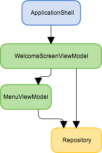

# Lifestyles

When you have two classes: `HomeViewModel` and `ApplicationSettingsViewModel`, both with dependency on `IUserService`, should they both have the same instance of the user service, or each get their own?
When you go to application settings window, close it, and then open again, should you get the same instance of `ApplicationSettingsViewModel` or a new one?
When a component's instance is no longer needed, who and how should clean up after it: dispose it if needed, unsubscribe from receiving event aggregator's events and so on?

The answer is - it depends. The behavior is controlled by what's called the lifestyle of your components. Lifestyle controls in what scope instances are reused, and when to release them (that is do all the necessary clean up steps and then let it go for the Garbage Collector to destroy).

## Standard lifestyles: the common ones

Out of the box Windsor provides set of lifestyles that cover most real life scenarios.

### Singleton

Singleton components will only produce a single instance that is bound to the container. The instance will be created the first time someone requests it, and subsequently reused every time it's needed. Explicitly releasing singletons  (by calling `container.Release(mySingleton)`) does nothing. The sole instance will be released when the container it's registered with is disposed.
This is how you register a component as singleton:

```csharp
Container.Register(Component.For<MySingletonComponent>().LifestyleSingleton());
```

:information_source: **Default:** Singleton is the default lifestyle, which will be use if you don't specify any explicitly. So the registration above could be changed to: `Container.Register(Component.For<MySingletonComponent>());`

:information_source: **What singletons are good for:** Characteristics of singleton make it a good choice in several scenarios. State-less components are one good candidate. Components that have state that is valid throughout the lifetime of the application that all the other components may need to access. If your application is multithreaded, remember to make sure state changes in your singleton are thread safe. You may want to consider making your component a singleton especially if the objects have big state, in which case producing multiple instances may unnecessarily raise memory consumption of your application. Usually, with some practice, the decision is a quick and easy one.

### Transient

Transient can be seen as the opposite to singleton. Transient components are not bound to any tangible scope. Each time an instance of a transient component is needed, container will produce a new one, never reusing them. You can say that the scope of a transient's instance is dictated by its user. Therefore transient instances are released when the object using them is released.
If your transient component is the root of the graph (that is the class that uses it is not managed by the container) resolved explicitly via `container.Resolve<MyTransientComponent>()` you explicitly end its lifetime scope by calling `container.Release(myTransientInstance)` when you no longer need it.

This is how you register a component as transient:

```csharp
Container.Register(Component.For<MyTransientComponent>().LifestyleTransient());
```

:warning: **Transient components may be tracked by the container: `Release` what you `Resolve`d:** Some people, especially those who used certain other containers in the past, sometimes forget that Windsor may track transient components. They `Resolve` the instances, and never `Release` them. To ensure proper components lifecycle management Windsor may track those components. That means that unless you release them, Garbage Collector will not be able to reclaim them, and you'll end up with de-facto memory leak. So remember this useful rule of thumb: Remember to `Release` what you explicitly `Resolve`d.}

:information_source: **What transients are good for:** Transient lifestyle is a good choice when you want to be in control of instance's lifetime. When you need new instance, with new state every time. Also transient components don't need to be thread safe, unless you explicitly use them in multi-threaded situations. In most applications you'll find that a large percentage of your components will end up as transient.

### PerWebRequest

Instance of a component will be shared in scope of a single web request. The instance will be created the first time it's requested in scope of the web request. Releasing it explicitly does nothing. Instance will be released upon the end of the web request.

This is how you register a component as per web request:

```csharp
Container.Register(Component.For<MyPerWebRequestComponent>().LifestylePerWebRequest());
```

:warning: **Registering `PerWebRequestLifestyleModule`:** In order to function properly per web request requires a `IHttpModule` - `Castle.MicroKernel.Lifestyle.PerWebRequestLifestyleModule` to be registered in your web.config:

```xml
<httpModules>
   <add name="PerRequestLifestyle" type="Castle.MicroKernel.Lifestyle.PerWebRequestLifestyleModule, Castle.Windsor"/>
</httpModules>
```

if you're running on IIS7 you may need to register it in `system.webServer/modules` section instead.

```xml
<configuration>
   <system.webServer>
      <modules>
         <add name="PerRequestLifestyle" type="Castle.MicroKernel.Lifestyle.PerWebRequestLifestyleModule, Castle.Windsor" />
      </modules>
   </system.webServer>
</configuration>
```

## Standard lifestyles: the less common ones

The lifestyles described above are the bread and butter of most applications. Occasionally though you'll need a more specialized lifestyle.

### Scoped

Windsor 3 added option to specify arbitrary scope of component instance lifetime/reuse. Here's how you do it:

```csharp
Container.Register(Component.For<MyScopedComponent>().LifestyleScoped());
```

Now consider the following scenario:

```csharp
using Castle.MicroKernel.Lifestyle;

using (Container.BeginScope()) //extension method
{
	var one = Container.Resolve<MyScopedComponent>();
	var two = Container.Resolve<MyScopedComponent>();
	Assert.AreSame(one, two);

} // releases the instance
```

In the code above the using block encloses the scope of reuse (whenever an instance is needed inside the scope the same will be used) and lifetime (end of the using block releases the instance.

:information_source: **`CallContext` scope:** For the more inquisitive of you, the scope is bound to the [CallContext](http://msdn.microsoft.com/en-us/library/system.runtime.remoting.messaging.callcontext.aspx). What that mean is that is's available on the current thread, but also flows to thread pool and `Task` threads. In multi threaded scenarios however, be careful to ensure the child operation finishes before the end of using block on the parent thread is executed.

#### Custom scopes

In addition to the default, `CallContext` scope, you can bind your components to any arbitrary scope you choose, by implementing `Castle.MicroKernel.Lifestyle.Scoped.IScopeAccessor` interface. (see [implementing custom scope](implementing-custom-scope.md)).

You then specify the scope accessor when registering your component:

```csharp
Container.Register(Component.For<MyScopedComponent>().LifestyleScoped<MyCustomScopeAccessor>());
```

### Bound

Look at the following diagram.



Somewhere in the graph we have two view models, one depending on the other, and both of them depend on some other service, say a repository. You might want to *bind* the repository to the subgraph. In other words you might want the entire subgraph of the outermost view model (`WelcomeScreenViewModel`) to share the same instance of the repository, and to have the repository released when the view model itself is released.

This is what bound lifestyle is for.

```csharp
Container.Register(Component.For<Repository>().LifestyleBoundTo<ViewModelBase>());
```

:information_source: **Binding is done on implementation type:** Notice that when specifying type to bind to, we used `ViewModelBase` common base type of all view models. The binding doesn't look at services exposed by the container, but the actual implementation type of the component, and checks if it is assignable to the the specified type.

:information_source: **Bound lifestyle introduced coupling:** There's one important aspect you need to consider when choosing bound lifestyle. It assumes that repository (in our example) will always be resolved as a dependency of some view model. Sometimes that's OK, sometimes it's not. Make sure you consider it before choosing this lifestyle.

#### Bound to nearest

:information_source: This option is new in Windsor 3.2

In some cases instead of binding to the farthest matched object in the graph you may want to bind to the closest. That is `WelcomeScreenViewModel` will share the instance of the `Repository` with its (direct and indirect) dependencies, but once one of those dependencies happens to be another view model, it will get a new `Repository` for itself and its dependencies (direct and indirect) unless one of those dependencies happens to be yet another view model... You get the idea.

In that case you register the `Repository` using `BoundToNearest`

```csharp
Container.Register(Component.For<Repository>().LifestyleBoundToNearest<ViewModelBase>());
```

#### Bound: custom

When the default options are not enough you can provide your custom way to select the component to bind to by using the following overload of `BoundTo` method:

```csharp
BoundTo(Func<IHandler[], IHandler> scopeRootBinder)
```

You can pass a custom delegate that from the collection of the `IHandler`s representing components in the subgraph (from the outermost to innermost) selects the one you want to bind your component to.

## Standard lifestyles: the *very* rarely used ones

The lifestyles described above are all that 99% of applications will ever need. Feel free to stop reading here, as chances are you will never need or even see any of the lifestyles described below.
For some corner cases, Windsor provides additional lifestyles.

### PerThread

Instance of a component will be shared in scope of a single thread of execution. It will be created the first time the component is requested on given thread. Releasing the component explicitly does nothing. Instances will be released when the container they're registered with is disposed.

:information_source: **Think twice before using this lifestyle:** Per thread lifestyle is a specialized lifestyle, and you should really think twice before you use it. Basically it should be used only when your application controls the thread, and never when thread pool threads (or `Task`s) are involved. When in doubt - avoid.

### Pooled

A pool of instances will be created and then one of them will be returned when requested. Poolable lifestyle has two parameters that influence its behavior - `initialSize` and `maxSize`.

When the component is first requested, the pool of `initialSize` elements is instantiated and a single one of them is marked internally as *in use* and returned. When more components are requested, the pool will first return all of the components it has that are not *in use*, and if it runs out, will start creating new ones. Releasing the components may do either of two things:

1. When the pool has more components *in use* than `maxSize` the component will be released immediately
2. Otherwise the component will be recycled (if it implements `IRecyclable`) and returned to the pool marked as *ready to use*.

#### The `IRecyclable` interface

Windsor provides a special interface - `Castle.Core.IRecyclable` for poolable components. It contains single method:

```csharp
void Recycle();
```

This method is invoked when the component is returned to the pool, and components can use it to implement custom initialization/clean up logic.

## Custom lifestyles

Allows you to set your own implementation of `ILifestyleManager` for the component. Also used be some facilities, like WCF Facility which provides two additional lifestyles - per WCF session and per WCF operation.

## Setting lifestyle

The most common way to specify a lifestyle is through the registration API. You can do it for a single component, as shown in the examples above. The same methods are also available when registering a set of types.
For example here's how you can make all your controllers transient when registering:

```csharp
Container.Register(
   Classes.FromThisAssembly()
      .BasedOn<IController>()
      .LifestyleTransient());
```

### Via XML

It is also possible to set lifestyle from [XML configuration](registering-components.md#component-with-lifestyle).

### Via Attributes

Windsor provides set of attributes that you can use to set suggested lifestyle for your components.

:information_source: **Prefer other solutions:** Lifetime attributes are targeted at low level components, that extend the container itself. For your domain services, it's better to use any of the other approaches, so that you don't need to reference the container in your domain.

The attributes are available in `Castle.Core` namespace, and all of them inherit from `Castle.Core.LifestyleAttribute`.

There's an attribute for each lifestyle described above, each of them named after the lifestyle.
Here's how you mark a type as transient using `TransientAttribute` attribute.

```csharp
[Transient]
public class MyTransientComponent
{
   // something here...
}
```

:information_source: **Attributes are for defaults:** The attributes denote suggested lifestyle for the component. You can override it by specifying other lifestyle explicitly from fluent API, or XML configuration.
