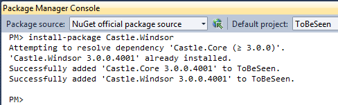

# Windsor Tutorial - Part One - Getting Windsor

From a development environment perspective Windsor is just a library. There's no need to "install" anything and no additional tooling is required. So to get started, you need to get Windsor onto your machine.

## Getting Windsor

There are a few ways you can get Windsor. You can use either a package manager like NuGet or do it the old way - [by getting the file manually](https://github.com/castleproject/Windsor/releases). The simplest way (and likely the most popular these days) is to use Nuget and that's what we'll do.

## Creating Visual Studio solution

* Start your Visual Studio.
* Go to File -> New -> Project...
* Select ASP.NET MVC 3 Web Application
* Pick Internet Application template and Razor view engine
* If you want to, you can select "Create a unit test project". We won't, we'll add one manually at a later point

This should create the default bare-bone ASP.NET MVC 3 project for you. Now let's add Windsor to it.

## Adding Windsor

:information_source: **Getting NuGet:** This part requires Nuget Package Manager. If you don't have it yet, you can get it from [http://nuget.org](http://nuget.org/) or directly in your Visual Studio, by going to Tools-->Extension Manager... and searching for NuGet Package Manager}

* Open Package Manager Console (View-->Other Windows-->Package Manager Console)
* After it has initialized type (`Install-Package Castle.Windsor`)

After a few seconds NuGet will pull Windsor and it's dependencies (Castle.Core).

## Summary

Now you have added Windsor into your application and are ready to start taking advantage of it. If you've completed all the steps let's proceed to [part two](mvc-tutorial-part-2-plugging-windsor-in.md) and start writing some actual code.