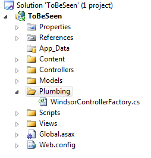
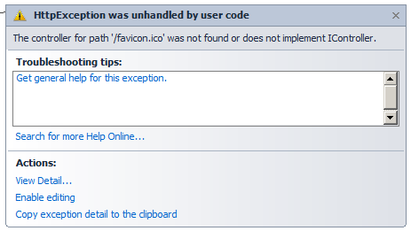

# Windsor Tutorial - Part Two - Plugging Windsor in

In [part one](mvc-tutorial-part-1-getting-windsor.md) we created *empty* MVC 3 application, and added Windsor but didn't do anything with it yet. To get started using Windsor we need to plug it into the application. The first and most publicized MVC extension point that we'll look at is controller factory. We'll use it to have Windsor manage our controllers and all of their dependencies.

## Controller Factory

Contrary to all other frameworks, the IoC container is like a good network administrator. If it's doing its job properly (read - if you're using it properly) you won't even notice you have one. In other words, there won't be explicit calls to the container and interaction with its API all over the codebase, like you would find when dealing with logging framework, presentation framework (like ASP.NET MVC) or persistence framework (like [NHibernate](http://nhforge.org/)).

Controller factory is **the only** place where any explicit interaction with the container will happen (except for the `global.asax` file when we'll bootstrap the container). That is really surprising to a lot of people, and hard to believe, so if you have to, just take my word for it, and later on you'll see how it all works, and how leveraging Inversion of Control (the pattern) makes it possible for the container to do so much work for you.

Folder for plumbing code and controller factory:



The controller factory is a plumbing, low level class, that you never even call from your own code. To make that explicit I created a subfolder called `plumbing` in my project, and added a new class `WindsorControllerFactory` there. The class inherits MVC's `DefaultControllerFactory` and overrides two methods:

```csharp
using System;
using System.Web;
using System.Web.Mvc;
using System.Web.Routing;
using Castle.MicroKernel;

public class WindsorControllerFactory : DefaultControllerFactory
{
	private readonly IKernel kernel;

	public WindsorControllerFactory(IKernel kernel)
	{
		this.kernel = kernel;
	}

	public override void ReleaseController(IController controller)
	{
		kernel.ReleaseComponent(controller);
	}

	protected override IController GetControllerInstance(RequestContext requestContext, Type controllerType)
	{
		if (controllerType == null)
		{
			throw new HttpException(404, string.Format("The controller for path '{0}' could not be found.", requestContext.HttpContext.Request.Path));
		}
		return (IController)kernel.Resolve(controllerType);
	}
}
```

:information_source: **`favicon.ico` and 404 error:** If you're running your app with the debugger attached you may notice that on some browsers you'll be getting 404 errors when requesting icon for your application.



This doesn't have anything to do with Windsor, but is quite annoying. You can remedy that by ignoring the request in your routing rules. Add the following code to your `RegisterRoutes` in `Global.asax.cs`. In MVC 4 and 5 this will be in the RouteConfig in App_Start

```csharp
routes.IgnoreRoute("{*favicon}", new { favicon = @"(.*/)?favicon.ico(/.*)?" });
```

## Windsor Controller Factory

Controller factory has two responsibilities - it provides the MVC runtime with new instances of the controller type for each request, and when the request ends it releases the controller. To do it we use `IKernel` provided by Windsor, which is an interface that we use to have Windsor resolve services for us, and also tell it to release them when we're done using them.

We leverage the base implementation of the factory to figure out based on the route which controller type should handle the request. In some cases when the engine can't find a controller a null type will be provided in which case we return 404. Otherwise, we resolve the controller.

:information_source: **What about `IControllerActivator`?** In version 3 of its MVC framework Microsoft introduced a new abstraction - `IControllerActivator`, which in a similar manner to Windsor's [lifestyles managers](lifestyles.md) and [component Activators](component-activators.md) makes controller factories responsible for managing controller instances, and makes activators responsible for creation of new instances. However this abstraction is fatally flawed, which makes it unusable. It only has a `Create` method, and lacks method for releasing the controllers. This **is** a big deal, as you'll see later in the tutorial, and that's why we're sticking to controller factory only.

## Summary

In this part we created a controller factory which uses Windsor to manage components in our application. In [part 3](mvc-tutorial-part-3-writing-your-first-installer.md) we'll look at integrating it with our application, and delegating component management to Windsor.