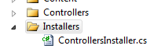

# Windsor Tutorial - Part Three - Writing Your First Installer

In [part two](mvc-tutorial-part-2-plugging-windsor-in.md) we created our custom controller factory. Now we need to tell Windsor all it needs to know about our controllers for it to successfully manage them.

## Installers

Windsor uses dedicated classes called [installers](installers.md) to feed the container with knowledge about our types (this process is called registration). You will usually have at least several installers in any real life application so it's important to keep them tidy and visible. To achieve that let's create a dedicated project folder where we'll keep them. The first components we'll register into the container are our controllers, so let's start with creating `ControllersInstaller` class.



## Controllers installer

Our installer needs to tell Windsor two things: how to find controllers in our app, and how to configure them.

The first part - finding controllers - is easy, as ASP.NET MVC requires by convention, that controllers implement `IController`  interface.

Configuration for now will be pretty simple too. First of all, MVC framework requires that we create a new controller instance each time it asks us for one. This is different from Windsor's default which would create just one instance the first time we ask for one, and then reuse it for all subsequent requests. The installer that meets the requirements may look like this:

```csharp
using System.Web.Mvc;
using Castle.MicroKernel.Registration;
using Castle.MicroKernel.SubSystems.Configuration;
using Castle.Windsor;

public class ControllersInstaller : IWindsorInstaller
{
    public void Install(IWindsorContainer container, IConfigurationStore store)
    {
        container.Register(Classes.FromThisAssembly()
            .BasedOn<IController>()
            .LifestyleTransient());
    }
}
```

The installer uses the `container` parameter of the `Install` method to `Register` controllers using Windsor's [Fluent Registration API](fluent-registration-api.md). This is the recommended way of working with Windsor as it is the most terse, and  the most flexible. Every time we add a new controller type into our application (and big apps can have hundreds of them) it will be automatically registered, we don't need to do anything else other than making sure we follow the conventions we established.

Let's quickly go over what the code does. `Classes` static class is the entry point to the registration and it will look for public, non-abstract classes `FromThisAssembly`, that is the assembly containing the installer (that is our MVC assembly, which is where, indeed, the controllers live).

We don't want just any type from the assembly though. The `BasedOn<IController>` filters the classes even further to just those that implement `IController`. The method is named `BasedOn` rather than `Implements` because it can be used for base classes just as well as interfaces, and it even handle open generic types (but let's not worry about that just yet).

The last part controls a very important aspect of working with Windsor - [instance lifestyle](lifestyles.md). Transient is what MVC framework expects that is, a new instance should be provided by Windsor every time it is needed, and it's the caller's responsibility to tell Windsor when that instance is no longer needed and can be discarded (That's what the `ReleaseController` method on our controller factory is for).

## Summary

Now we have working mechanism for registering our controllers (of which we at the moment have two that come out of the box with the default MVC template) in Windsor. We also have a controller factory that can offload the work of managing the controllers to Windsor. In [Part four](mvc-tutorial-part-4-putting-it-all-together.md) we'll glue all these parts together to have a working - Windsor backed application, but before we get there, there's one more thing we need to take care of - [tests](mvc-tutorial-part-3a-testing-your-first-installer.md).