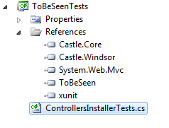
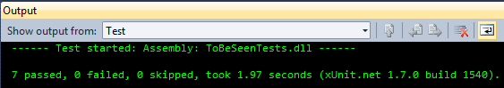

# Windsor Tutorial - Part Three (a) - Testing Your First Installer

## Introduction

Windsor installers may seem esoteric at first, but they are like any other kind of code. As such they have to obey all the rules we apply to our code, and that means - they have to be tested. Thoroughly. I'm serious.

It is crucially important to test your installers and validate the conventions they rely on. First of all to make sure you're using Windsor's registration API properly and it does what you think it does. Also, more importantly this is going to be your safety net, that will protect you from breaking changes. As your application grows, and you add new classes, and new services, and new people join your team, it is crucially important to make sure the conventions are obeyed. The compiler won't do it for you - it does not know about the conventions, so you must write tests that ensure the conventions you've established are being followed. Trust me - this will pay back in a big way.

## Let's start



We start by adding a test project to the solution. We also reference our unit testing library (we'll be using [xUnit.net](http://xunit.codeplex.com/)) and add out first test file to the project.

## Our first test

Let's remind ourselves how we register the controllers:

```csharp
public class ControllersInstaller:IWindsorInstaller
{
    public void Install(IWindsorContainer container, IConfigurationStore store)
    {
        container.Register(Classes.FromThisAssembly()
            .BasedOn<IController>()
            .LifestyleTransient()));
    }
}
```

The convention we've established has two parts: selection (where we select the right types) and configuration (where we decide how to configure the components). here's what each of them specifies:

Selection defines what is a controller in our application:

* Types that implement `IController` interface

Configuration decides how the controller components should be configured:

* Should have `Transient` lifestyle (we'll discuss lifestyles in greater depth in later part of the tutorial)
* Should expose single service - their implementation type (that's a rule, which we didn't specify explicitly, relying on Windsor's default behavior instead)

Let's write tests for all of them in turn. First though, we need to set up the scene for our tests:

```csharp
private IWindsorContainer containerWithControllers;

public ControllersInstallerTests()
{
    containerWithControllers = new WindsorContainer()
        .Install(new ControllersInstaller());
}
```

This is what you would use the `SetUp` method for if you were using NUnit, or MbUnit - code that runs before every test and sets the stage for it. We create a new container instance, and install our `ControllersInstaller`, which is what we're testing.

Now, let's start by verifying the first rule - that all types implementing `IController` are registered and that only types implementing `IController` are registered. The second part is equally important - we want to make sure we don't have any false positives.

```csharp
[Fact]
public void All_controllers_implement_IController()
{
    var allHandlers = GetAllHandlers(containerWithControllers);
    var controllerHandlers = GetHandlersFor(typeof(IController), containerWithControllers);

    Assert.NotEmpty(allHandlers);
    Assert.Equal(allHandlers, controllerHandlers);
}
```

`GetAllHandlers` and `GetHandlersFor` are helper methods for our test that return all [Handlers](handlers.md) from the container, and all handlers where implementation type is assignable to a given type, respectively.

Here's how you could implement them:

```csharp
private IHandler[] GetAllHandlers(IWindsorContainer container)
{
    return GetHandlersFor(typeof(object), container);
}

private IHandler[] GetHandlersFor(Type type, IWindsorContainer container)
{
    return container.Kernel.GetAssignableHandlers(type);
}
```

We also check that anything at all is registered in the container.

This test only validates the first part of our assumption. Let's now write a test for the second part - to verify that indeed all types implementing `IController` from our application assembly are registered by the `ControllersInstaller`

```csharp
[Fact]
public void All_controllers_are_registered()
{
    // Is<TType> is an helper, extension method from Windsor in the Castle.Core.Internal namespace
    // which behaves like 'is' keyword in C# but at a Type, not instance level
    var allControllers = GetPublicClassesFromApplicationAssembly(c => c.Is<IController>());
    var registeredControllers = GetImplementationTypesFor(typeof(IController), containerWithControllers);
    Assert.Equal(allControllers, registeredControllers);
}
```

We're finding all controller classes in the assembly, and getting implementation types of each component registered and making sure the sets are equal.

In there we're using two more helper methods:

```csharp
private Type[] GetImplementationTypesFor(Type type, IWindsorContainer container)
{
    return GetHandlersFor(type, container)
        .Select(h => h.ComponentModel.Implementation)
        .OrderBy(t => t.Name)
        .ToArray();
}

private Type[] GetPublicClassesFromApplicationAssembly(Predicate<Type> where)
{
    return typeof(HomeController).Assembly.GetExportedTypes()
        .Where(t => t.IsClass)
        .Where(t => t.IsAbstract == false)
        .Where(where.Invoke)
        .OrderBy(t => t.Name)
        .ToArray();
}
```

:information_source: **Are we repeating ourselves?** A complaint I sometimes hear when taking about installer testing is that it's testing Windsor and repeating what we already specified in the installer. While it may appear that way on the surface, it's more than that. The tests validate that you're using the installer in the intended way. They shield you from accidental changes, both to the installer and to the code it scans. And they help you keep consistency in the structure of your project. The last point should not be underrated.

### Consistency

While the installer only requires controllers to implement `IController` to work correctly, a good practice is to be more demanding. With default routing rules in ASP.NET MVC controller classes should each have `Controller` suffix. Also the default structure of the project puts them all in a common namespace.

Neither of those can be validated by the compiler. However we can easily use container and our existing test code the enforce those rules.

```csharp
[Fact]
public void All_and_only_controllers_have_Controllers_suffix()
{
    var allControllers = GetPublicClassesFromApplicationAssembly(c => c.Name.EndsWith("Controller"));
    var registeredControllers = GetImplementationTypesFor(typeof(IController), containerWithControllers);
    Assert.Equal(allControllers, registeredControllers);
}

[Fact]
public void All_and_only_controllers_live_in_Controllers_namespace()
{
    var allControllers = GetPublicClassesFromApplicationAssembly(c => c.Namespace.Contains("Controllers"));
    var registeredControllers = GetImplementationTypesFor(typeof(IController), containerWithControllers);
    Assert.Equal(allControllers, registeredControllers);
}
```

Those tests are pretty straightforward and follow the same pattern. We verify that types meeting each single criterion is the same as the set of implementation types of our components. Having this done and working (go ahead and run the tests. [You can find the implementation of the helper methods in the sourcecode](https://github.com/kkozmic/ToBeSeen/blob/a88873244952ca55857e0ff99e16a428f21ab83c/tst/ToBeSeenTests/ControllersInstallerTests.cs)) it's time to verify that we configured the types the way we wanted to.

### Configuration tests

Here are the remaining tests covering configuration.

```csharp
[Fact]
public void All_controllers_are_transient()
{
    var nonTransientControllers = GetHandlersFor(typeof(IController), containerWithControllers)
        .Where(controller => controller.ComponentModel.LifestyleType != LifestyleType.Transient)
        .ToArray();

    Assert.Empty(nonTransientControllers);
}

[Fact]
public void All_controllers_expose_themselves_as_service()
{
    var controllersWithWrongName = GetHandlersFor(typeof(IController), containerWithControllers)
        .Where(controller => controller.ComponentModel.Services.Single() != controller.ComponentModel.Implementation)
        .ToArray();

    Assert.Empty(controllersWithWrongName);
}
```

We're using information provided by handlers to verify everything is configured as expected. Notice one interesting twist in these tests. We're trying to find handlers that do NOT conform to our specified rule and assert the set is empty. This will prove beneficial when you have a misconfigured service - only that one service will be returned so you'll be able to immediately see which one is it.

Before we proceed, let's run the tests to verify they all pass.



They do! - we can now proceed to [the next part of the tutorial](mvc-tutorial-part-4-putting-it-all-together.md).