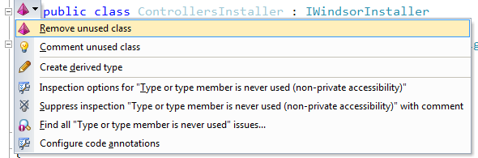

# Windsor Tutorial - Part Four - Putting it All Together

## Bootstrapping Windsor

What we're missing is to actually create our container we'll be using in the app (the one and only instance), install our installer, and tell MVC infrastructure to use our controller factory instead of its own default. All of that happens in the `global.asax` file.

To do this let's add the following code, and invoke `BootstrapContainer` method at the end of `Application_Start`:

```csharp
using Castle.Windsor.Installer;

private static IWindsorContainer container;

private static void BootstrapContainer()
{
    container = new WindsorContainer()
        .Install(FromAssembly.This());
    var controllerFactory = new WindsorControllerFactory(container.Kernel);
    ControllerBuilder.Current.SetControllerFactory(controllerFactory);
}
```

We're instantiating the `WindsorContainer` class which is the core class in Windsor (as its name implies). We then call its `Install` method. Reading it from inside out, the [FromAssembly class](installers.md#fromassembly-class) will look for, instantiate and return all installers in our assembly (this means our sole `ControllersInstaller` for now, but in the future we'll have more). Then `WindsorContainer` will call down to each of those installers, which in turn will register the components specified by each installer.

:information_source: If this sounds a bit too technical and is not very clear - don't worry. Once you start using it it'll all make sense

:information_source: **ReSharper says the installer is not being used:** If you're using [ReSharper](http://www.jetbrains.com/resharper/) or any other static analysis tool, you may notice it claims that your installers (and as you'll see later on, your services too) are not being used.



Do not be alarmed by that. Remember, those types are being used, but via a convention, so there's no **hard** reference to them, which is what static analysis tools rely on.

We then create our `WindsorControllerFactory` passing it the `Kernel` wrapped by the container, and we attach the factory to MVC infrastructure.

Finally, we need to clean up when the application ends (remember - clean up is as important as creation).

```csharp
protected void Application_End()
{
    container.Dispose();
}
```

The clean up means simply disposing of the container.

At this point you will have application that looks and behaves exactly like the default application that we started with. However, having Windsor in it opens new and exciting possibilities that we'll explore in [part five](mvc-tutorial-part-5-adding-logging-support.md).