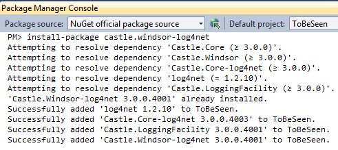
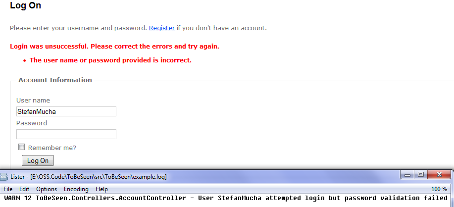

# Windsor Tutorial - Part Five - Adding logging support

## Introduction

Now that we have the basic infrastructure in place it's time to start adding value to our application. Well - almost. One of the concern that should be thought on early in an application is logging. We'll use Windsor to help us configure that properly. In this part you'll see how you can use [facility](facilities.md) to extend what Windsor provides out of the box.

## Logging Facility

As mentioned in one of previous parts, Windsor comes with some additional, optional facilities, which are extensions to the out of the box functionality of Windsor. In this part we'll add the [logging facility](logging-facility.md) to the application.

The facility provides common abstraction for major logging frameworks such as [log4net](http://logging.apache.org/log4net/index.html) and [NLog](http://nlog-project.org/) as well as built in logging mechanism of `Trace` class. This provides you with a common abstraction for the *unlikely* case of changing the logging framework after you start working on your application. More importantly though, the facility takes care of providing your classes with correct `ILogger` instance for their need, without any additional static dependency, that is present in most applications not using Castle Windsor.

To start we need to add the required packages. Fire up NuGet's Package Manager Console and type: `Install-Package Castle.Windsor-log4net`

This will pull all the required dependencies for you.



### Installer

Now that we referenced the right assemblies, let us create an installer (I told you we'll have quite a few of those) to add the facility to the application.

:information_source: Make sure you create the installer in the `Installers` folder, next to `ControllersInstaller`. While technically there's no need for that, it's a good idea to keep the project tidy.

```csharp
using Castle.Facilities.Logging;
using Castle.MicroKernel.Registration;
using Castle.MicroKernel.SubSystems.Configuration;
using Castle.Windsor;

public class LoggerInstaller : IWindsorInstaller
{
    public void Install(IWindsorContainer container, IConfigurationStore store)
    {
        container.AddFacility<LoggingFacility>(f => f.UseLog4Net());
    }
}
```

:information_source: If you're not seeing the `UseLog4Net()` method make sure you've referenced full profile (and not client profile) version of `Castle.Facilities.Logging`.

Notice the pattern the API is using. The generic parameter specifies the type of the facility we want to add, and then we use a lambda to configure the facility (in this case telling it we'll be using log4net).

We didn't specify where log4net configuration will be located, and by default the facility will look for `log4net.config` file, which is the central point for you to change log4Net configuration apart from castle library. Let's add one to the project. It will contain standard log4net configuration, like the following example:

```xml
<?xml version="1.0" encoding="utf-8" ?>
<configuration>
  <log4net>

    <appender name="RollingFile" type="log4net.Appender.RollingFileAppender">
      <file value="error.log" />
      <appendToFile value="true" />
      <maximumFileSize value="100KB" />
      <maxSizeRollBackups value="2" />

      <layout type="log4net.Layout.PatternLayout">
        <conversionPattern value="%level %thread %logger - %message%newline" />
      </layout>
    </appender>

    <root>
      <level value="DEBUG" />
      <appender-ref ref="RollingFile" />
    </root>
  </log4net>
</configuration>
```

You should modify LoggerInstaller to add

```csharp
[assembly: XmlConfigurator(Watch = true)]
public class LoggerInstaller : IWindsorInstaller
{
    public void Install(IWindsorContainer container, IConfigurationStore store)
    {
        log4net.Config.XmlConfigurator.Configure();
        container.AddFacility<LoggingFacility>(f => f.UseLog4Net());
    }
}
```

log4net documentation does a good job at explaining the meaning of each element of the file so we won't discuss that here.

### What we just did?

"How is this used?", you might ask? All you need to do is to ask for a reference to the `ILogger` interface that resides in the `Castle.Core` assembly in the `Castle.Core.Logging` namespace, (common practice is to use a settable property rather than the constructor for that) and you're all set. The container will provide you with a configured and ready to use `ILogger` instance. To see this in action let's add a warning log entry to the `AccountController` for when the user attempts to login with a wrong password.

```csharp
public class AccountController : Controller
{
	// this is Castle.Core.Logging.ILogger, not log4net.Core.ILogger
	public ILogger Logger { get; set; }

	[HttpPost]
	public ActionResult LogOn(LogOnModel model, string returnUrl)
	{
		if (ModelState.IsValid)
		{
			if (MembershipService.ValidateUser(model.UserName, model.Password))
			{
				//Removed for brevity
			}
			else
			{
				Logger.WarnFormat("User {0} attempted login but password validation failed", model.UserName);
				ModelState.AddModelError("", "The user name or password provided is incorrect.");
			}
		}

		// If we got this far, something failed, redisplay form
		return View(model);
	}
}
```

Now logging in with incorrect credentials will produce a log entry, provided your log4net configuration is correct.



## Summary

In closing, just remember that `ILogger` interface might exist in the logging framework that you use (as is the case with log4Net). Just take extra note that we use the `ILogger` interface that resides in `Castle.Core` assembly in `Castle.Core.Logging` namespace.

Continue with the [Windsor Tutorial - Part Six - Persistence Layer](mvc-tutorial-part-6-persistence-layer.md).