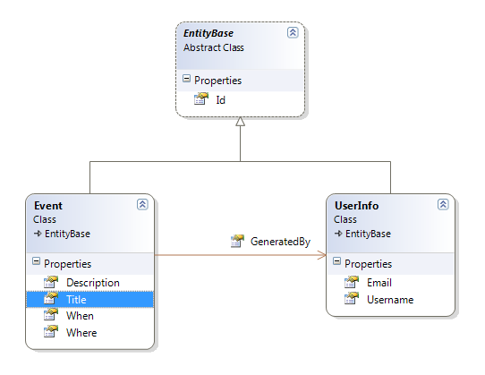
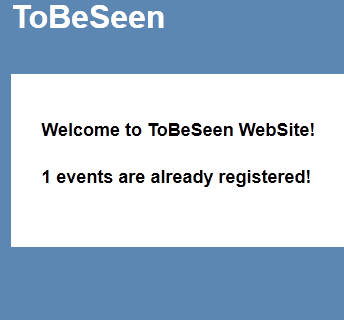

# Windsor Tutorial - Part Six - Persistence Layer

## Adding Persistence Layer

In previous parts we saw how to change a regular ASP.NET MVC application to use a container. Now let's add a persistence layer in place so that we can start with business scenarios of our little application. We'll be using [NHibernate 3.2](http://nhforge.org) along with [FluentNHibernate](http://fluentnhibernate.org/) as our persistence layer but in reality the same practices shown can be used with other persistence frameworks such as EntityFramework.

## Creating the Domain Model

For starters, let us create a simple domain. Our goal, as mentioned before, is to have an application that collects our data about upcoming musical albums, movies, books and events and send us a reminder on a predefined schedule.

Just to keep it simple, we'll store event information, along with logged-in user information (name and email) which we'll use to send a reminder email later. Later we may add 'Recurring' feature and give the user fine-grained scheduling system. Here's how the domain model looks like now.



## Setting up NHibernate

We'll be doing more than just registering our components in the container. Instead of creating a new [Installer](installers.md) class, let's create a [Facility](facilities.md).

:information_source: **Facility vs Installer:** We chose to write a facility because in order to use NHibernate we need to not only register certain components, but also configure and bootstrap the framework. In cases like this a facility is the recommended option.

In order to get NHibernate fully up and running, we need to do the following things:

* Configure connection to the database and low level database related things.
* Create mapping for our classes so that NHibernate knows how to CRUD them.
* Expose surface-area NHibernate components via the container so that we can use them in the application.

Let's start by creating an empty facility first.

```csharp
public class PersistenceFacility : AbstractFacility
{
	protected override void Init()
	{
		throw new NotImplementedException();
	}
}
```

We inherit from [`AbstractFacility`](https://github.com/castleproject/Castle.Windsor/blob/master/src/Castle.Windsor/MicroKernel/Facilities/AbstractFacility.cs) which provides the basic bootstrapping for common facility needs. It also requires us to override single method - `Init` which is where we'll put our facility initialisation code. That method is called once, after the facility is added to the container and lets it prepare for the work it's going to be doing.

We start off by bootstrapping the database settings and adding mapping for our classes. This is all FluentNHibernate specific and has nothing to do with Windsor so we won't discuss the details here.

:information_source: You can always see the entire code [on github](https://github.com/kkozmic/ToBeSeen)

### Registering components - via factory method

Now we need two more things - `ISessionFactory` and `ISession` (those are the user-level interfaces via which we interact with the database in our own code). We will register these components with a different approach to our controllers. We have an open-ended set of controllers in the application, which is going to grow as we develop our application. In this case however, we have just one of each of these interfaces, and we won't need different implementations. They are each one of a kind and there is no point in coming up with a convention to register just one class.

We also don't want Windsor to create instances of these services - NHibernate is responsible for that. We don't have a pre-existing instance we can use, either. Actually even if we did, it still would not be good - we want more than one instance of `ISession` so that we can utilise the [Unit of Work pattern](http://martinfowler.com/eaaCatalog/unitOfWork.html) (don't get too concerned with this just yet if you don't know the pattern - we'll get to it).

After bootstrapping the database FluentNHibernate gives us `NHibernate.Cfg.Configuration` instance. That object is what we need to use to obtain the `ISessionFactory` for our application (notice this implies we'll have just one instance of `ISessionFactory` in the application). Similar, we want `ISession` to be obtained by calling `OpenSession` on `ISessionFactory`. Here's how we do it.

```csharp
var config = BuildDatabaseConfiguration();

Kernel.Register(
	Component.For<ISessionFactory>()
		.UsingFactoryMethod(_ => config.BuildSessionFactory()),
	Component.For<ISession>()
		.UsingFactoryMethod(k => k.Resolve<ISessionFactory>().OpenSession())
);
```

By `UsingFactoryMethod` we can specify a method which Windsor should use to obtain the value for us. There are a few overloads that provide us with varying levels of contextual information. For `ISessionFactory` we already have all we need. We're telling Windsor to use `BuildSessionFactory` method on the `config` we got from FluentNHibernate. The `Kernel` is a property we got from `AbstractFacility` which we can use to register components. It is of type `IKernel` which we can also use for resolving services from the container, as we'll see in a moment.

To get an `ISession` instance, we need to first get the `ISessionFactory` we just registered, and get a new session from the factory by calling `OpenSession()`. For that we're using a different overload of `UsingFactoryMethod`, one that gives us a single object - `k` (which is of type `IKernel`). As discussed above we can use this object to pull the `ISessionFactory` from the container and ask it for the `ISession` we need. So we say - *kernel, give me the `ISessionFactory` and I'll grab the `ISession` from it (via the `OpenSession()` method)*.

:information_source: **Using NHibernate with Windsor:** Note that there is a lot more you can do with a facility and this is just scratching the surface. You can check out the existing [NHibernate Facility](nhibernate-facility.md) that integrates Castle Windsor with bare bone NHibernate.

:information_source: **Cleanup:** There's one important, although invisible effect of what we just did. By registering the components we didn't just tell Windsor how to create them. Windsor will also take care of properly destroying the instances for us, thus taking care of managing their full lifetime. In layman terms, Windsor will dispose both objects when they are no longer being used. This means it will flush the changes we made to `ISession` to the database for us, and it will clean up the `ISessionFactory`. And we get all of this for free.

## Putting this all to work

Just to show how this works, we'll add count of already registered events (given that we have some entry in our database!) to the index page, but before we get there, how to use this facility we have created? Facilities should be registered at application initialisation. Some facilities (like built-in [Startable Facility](startable-facility.md)) need to be added before any components are installed, as they customize how the components get installed. This is not the case here - our facility can be added at any point during installation, because it doesn't depend on the container being in any particular state. So let's just create yet another installer class and add this facility to the container there.

```csharp
public class PersistenceInstaller : IWindsorInstaller
{
	public void Install(IWindsorContainer container, IConfigurationStore store)
	{
		container.AddFacility<PersistenceFacility>();
	}
}
```

Next, let's add a dependency on `ISession` instance to our `HomeController`:

```csharp
public class HomeController : Controller
{
	private readonly ISession session;

	public HomeController(ISession session)
	{
		this.session = session;
	}
}
```

Now all we need is to query the data from `ISession` instance and push it to the `ViewModel` property and finally show it on the view.

```csharp
public ActionResult Index()
{
	ViewModel.Message = "Welcome to ToBeSeen WebSite!";
	ViewModel.EventCount = session.QueryOver<Event>().RowCount();

	return View();
}
```

:information_source: **How to get the database set up:** If you don't want to create the database from the scratch, in the source code, in `DB` folder you'll find a `.bak` file you can use to create the database.



## Summary

We have set up NHibernate and exposed it to our application. However there's a flaw in our code. We'll have just one `ISession` instance, which is a bug, and we'll look at how to fix this in [part seven](mvc-tutorial-part-7-lifestyles.md) of [this tutorial](mvc-tutorial-intro.md).
