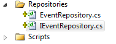

# Windsor Tutorial - Part Eight - Satisfying Dependencies

Until now, we have mostly been registering the components we need in the container, and except for the `ISession` instance, we have not used the container much. This is going to change now, as in this part we'll add a new controller to the application along with set of other objects.

## Adding `EventsController`

We have our `Event`s, let's add ability to actually interact with them. First let's add a new, empty, Controller to the application, and call it `EventsController`. Let's also add an empty `Index` action which we'll use to list the events set by the user.

```csharp
public class EventsController : Controller
{
    private readonly IEventRepository events;

    public EventsController(IEventRepository events)
    {
        this.events = events;
    }

    public ActionResult Index(int? page)
    {
        var eventPage = events.GetPage(page.GetValueOrDefault(1));
        return View(eventPage);
    }
}
```

To list the `Event`s we'll use a `IEventRepository` (discussed below). We'll also use paging to avoid issues when user has large number of `Event`s.

:information_source: The `Page<T>` class is very simple and uninteresting. However if you would like to read its code it's available in the solution.

## Adding Repository

The repository interface for now will have just one method, and its implementation is very basic. To keep our solution clean we also create a separate folder for out repositories and that's where we put the interface and its implementation.



```csharp
public interface IEventRepository
{
	Page<Event> GetPage(int pageNumber);
}

public class EventRepository : IEventRepository
{
	private readonly int pageSize;

	private readonly ISession session;

	public EventRepository(int pageSize, ISession session)
	{
		this.pageSize = pageSize;
		this.session = session;
	}

	public Page<Event> GetPage(int pageNumber)
	{
		var firstResult = pageSize * (pageNumber - 1);
		using (var tx = session.BeginTransaction())
		{
			var totalCount = session.QueryOver<Event>().ToRowCountQuery().FutureValue<int>();
			var events = session.QueryOver<Event>().Take(pageSize).Skip(firstResult).Future();
			var page = new Page<Event>(events, pageNumber, totalCount.Value, pageSize);
			tx.Commit();
			return page;
		}
	}
}
```

The implementation is very uninteresting as it's just a NHibernate 101. Let's now move to creating a view to display our events.

## Adding view

If you right click anywhere in the action method and select *Add-->View...* you will be presented with a window like that:


We need to make some changes in the view, like changing the model type to `Page<ToBeSeen.Event>` adjusting the rest of the template to this change, and adding paging, but that's all beyond the scope of this tutorial. Feel free to inspect the code if you're interested in those details.

## Almost ready

We're now almost ready to list our `Event`s. Let's do one last thing - add a link on the home page.

```html
<p>@Html.ActionLink("View your events","Index","Events")</p>
```

:information_source: **No mention of Windsor:** Notice nowhere in the code did we even mention Windsor. That's the Inversion of Control Principle at work - Windsor is out there, and we don't concern ourselves with it, concentrating on what the app is supposed to be doing, not how it's put together and other low level, mundane and uninteresting details.

If you go ahead and try to run the application... it will fail with an exception. Don't worry, it's not your fault. We all learn by making mistakes and in [the next part](mvc-tutorial-part-9-diagnosing-missing-dependency-issues.md) we'll explore how to diagnose missing dependency exceptions.