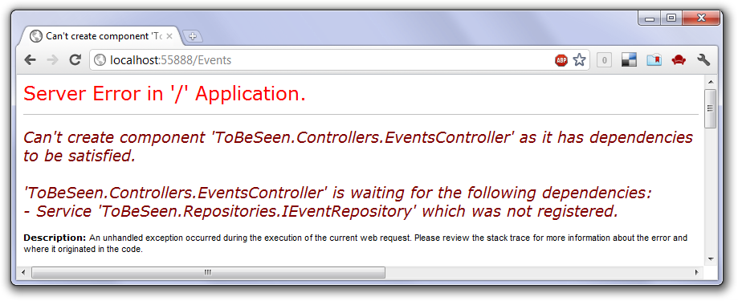
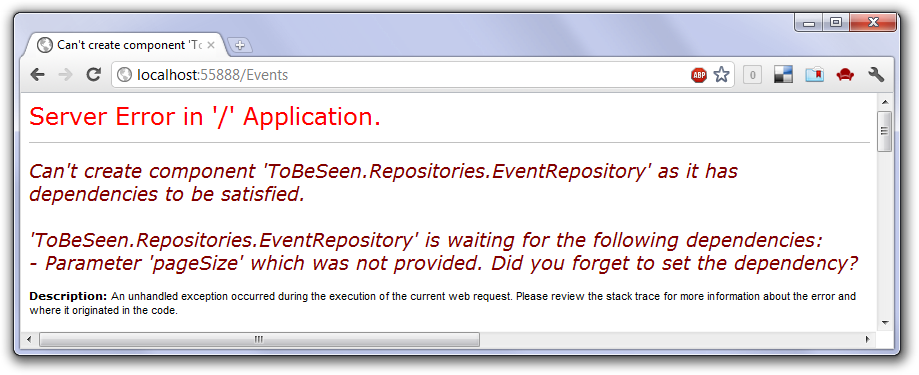
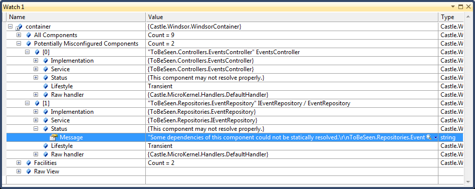

# Windsor Tutorial - Part Nine - Diagnosing missing dependency issues

## Introduction

The world is not perfect. We, humans, aren't perfect either. As such it happens we make mistakes and those mistakes in software (hopefully) are caught before the software goes into production. Windsor does its best to assist you in finding issues in your Windsor-related code as soon as possible. The reason being - Windsor *exceptions* are never exceptional. In other words, if Windsor throws an exception that means the container is not configured properly and all those issues can **and must** be detected during development.

In this part of the tutorial we'll take a deeper look at how to interpret exceptions thrown by Windsor and how to proceed when we find them.

## Missing dependency

Let's pick up where we left off in the last part. If you run the application and click the link to list all `Event`s, you will see the dreaded Yellow Screen of Death.

Exception thrown by Windsor when a service dependency could not be found:



The exception message reads:

```
Can't create component 'ToBeSeen.Controllers.EventsController' as it has dependencies to be satisfied.

'ToBeSeen.Controllers.EventsController' is waiting for the following dependencies:

- Service 'ToBeSeen.Repositories.IEventRepository' which was not registered.
```

If you read into it, the exception provides us with quite a few interesting informations:

* What was the error? - Windsor was unable to construct an instance of a component.
* Which component? - `ToBeSeen.Controllers.EventsController`.
* Why the component couldn't be created? - It is waiting for some dependencies.
* What dependencies? - `ToBeSeen.Repositories.IEventRepository` service.
* Why is it waiting? - Because the repository was not registered.

At this point this all should be obvious. We did add the repository class and interface to the solution, but we didn't register it. Let's quickly add a new `Installer` for that.

```csharp
public class RepositoriesInstaller : IWindsorInstaller
{
	public void Install(IWindsorContainer container, IConfigurationStore store)
	{
		container.Register(Classes.FromThisAssembly()
			                .Where(Component.IsInSameNamespaceAs<EventRepository>())
			                .WithService.DefaultInterfaces()
			                .LifestyleTransient()));
	}
}
```

:information_source: **Lifestyle of the repository:** So what should be the lifestyle of the repository? It will be used by a transient controller, and will be using a per-web-request session. This rules out making it singleton, and pretty much any other lifestyle other than transient and per web request. So which one should it be? In this case, since the repository doesn't have any state of its own either will be fine. We'll go with transient since it's usually a *safer* choice.

:information_source: **What about *releasing* the repository?** So we made the repository transient. Doesn't it mean we need to release it manually now? Well - no, it doesn't. We don't `Resolve` the repository (it gets pulled in by Windsor as a dependency of our controller), therefore it's Windsor's responsibility to `Release` it. Indeed, as we `Release` the controller (remember the `ReleaseController` of our controller factory?) Windsor will release entire graph as appropriate, which includes the repository. Hopefully you see the power of the approach, and the amount of code it will spare you from writing.

## Missing parameter

Let's compile the application and run it again.

Exception thrown by Windsor when a parameter dependency could not be found:



Another exception! This time though, the message is slightly different.

```
Can't create component 'ToBeSeen.Repositories.EventRepository' as it has dependencies to be satisfied.

'ToBeSeen.Repositories.EventRepository' is waiting for the following dependencies:

- Parameter 'pageSize' which was not provided. Did you forget to set the dependency?
```

So what can we learn from this message now?

* What was the error? - Windsor was unable to construct an instance of a component.
* Which component? - `ToBeSeen.Repositories.EventRepository` that is a different component this time.
* Why the component couldn't be created? - It is waiting for some dependencies.
* What dependencies? - `pageSize` parameter.
* How do we know it's a parameter? - because the exception says *Parameter*, rather than *Service* like last time and the dependency is a primitive type.
* Why is it waiting? - Because `pageSize` was not provided.

Notice the difference here - we're not waiting for a service dependency. It is on a parameter with the name `pageSize`. It is an `int`, - a primitive type, which can not be registered as a component.

From that it should be fairly easy to fix by adding just one line of code to the installer above:

```csharp
public class RepositoriesInstaller : IWindsorInstaller
{
    public void Install(IWindsorContainer container, IConfigurationStore store)
    {
        container.Register(Classes.FromThisAssembly()
            .Where(Component.IsInSameNamespaceAs<EventRepository>())
            .WithService.DefaultInterfaces()
            .LifestyleTransient()
            .Configure(c => c.DependsOn(new { pageSize = 20 }))
        );
    }
}
```

We're using an anonymous type as a convenient method of adding a named dependency to the component (actually all repositories, including those we add in the future).

## Debugger views

Notice that in order to find out we have some dependency issues in a specific part of the application, we had to actually go to that part of the application. To avoid issues like that, it's best to have a convention checking tests, like we wrote for our controllers in part 3a of the tutorial. However that does not always happen. For example if you're a consultant joining a team that's been developing an application for several months, you more often than not will find they don't have too many tests. In that case another feature of Windsor may come in handy in quickly locating spots of potential issues - debugger views.

### Using debugger views

To access that feature you need to start the application with the debugger attached and put a breakpoint somewhere where the container is in scope, after its fully configured and set up. If you bring the watch window and set it to display your container you will gain access to Windsor's diagnostics including list of "Potentially Misconfigured Components"



In here you can inspect all of the components Windsor's static analysis engine flagged as potentially misconfigured, which means it thinks it will not be able to resolve them if needed. If you navigate to Status/Message of each of these components you will see the same message as the exception above, which usually is enough to figure out what's wrong. There are a few more items in the debugger view window but they are all [very well documented](debugger-views.md) and I encourage you to read this documentation, as they will come handy to you on many occasions.