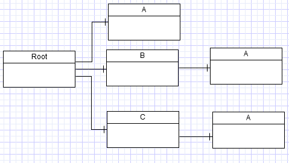
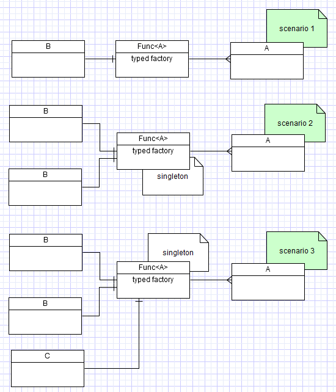
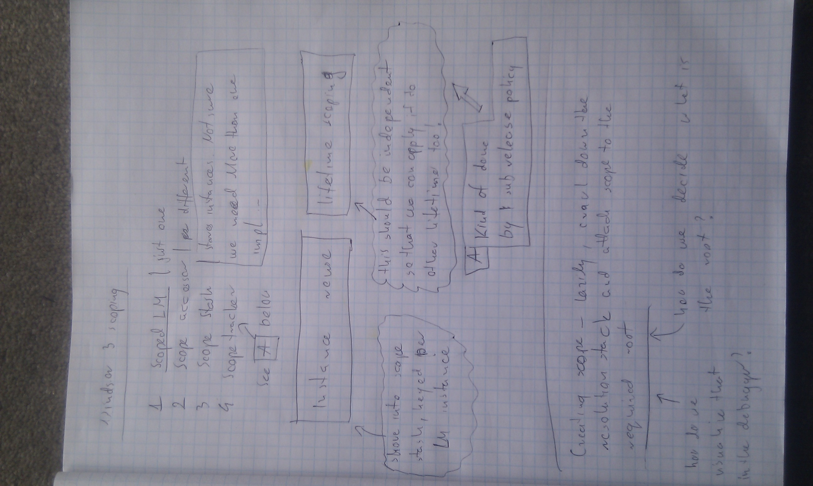

# Scratchpad - scopes in Windsor codename Wawel

Scratchpad for random thoughts regarding how scoping in Windsor codename Wawel should work.

## Per-root instance reuse

Imagine the following graph of components:

Graph for instances reuse per root component:



Scoping should make it possible to reuse the same instance within entire sub-graph of root component. In other words, all three occurrences of component A should be satisfied with a single instance of A. We'll call them graphed components

:information_source: **Reuse only:** This only addresses problem of reuse. What about scoping the lifetime of the object, that is - deciding when it should be gone?

## Syntax for registration

Simple and non-verbose syntax should be provided to register graphed components. Immediate idea that comes to mind is something like this

```csharp
container.Register(
   Component.For<Root>().Lifestyle.Transient.ScopeRoot(tag: typeof(IRoot)),
   Component.For<A>.Lifestyle.Graphed(inTag: typeof(IRoot)));
```

That would require doing work on both sides of the registration: graph root and graphed component. Preferable solution would be to only mark the graphed component in something like:

```csharp
container.Register(
   Component.For<Root>().Lifestyle.Transient,
   Component.For<A>.Lifestyle.Graphed(rootComponent: typeof(Root)));
```

This solution is however problematic. First up-front work would potentially have to be done to set up the scope when `Root` is being resolved. Moreover it is constrained to just a single component. That's unsuitable for real life scenarios.

One example of such scenario would be scoping NHibernate `ISession` per window in WPF app. Each window would be implemented by a different type. Also they would expose no common service, as each of them would most likely be registered to expose just its own class, much like controllers in a MVC app. This means we can't match by common service either. We could try by assignability of implementation type (implements `IWindow`). This approach is however hackish and I'd prefer to avoid it. Ideas for how best to do it are welcome...

## Syntax for registration - take two

I think we can safely rule out the first of aforementioned solutions as unnecessarily verbose and limiting. After having a good night' sleep I think something along the lines of the second solution should be used with having a few overloads of `Graphed` method, one of them pointing to a base type (with semantics like in `BasedOn` method of the fluent API). Another one using custom selection logic, in a fashion similar to `WithService.Select` of the registration API. That method could have the following signature and semantics.

```csharp
ComponentModel SelectScopeRoot(ComponentModel[] resolutionStack);
```

Resolution stack would be the all components in the given sub-branch of the tree, invoked the first time scoped component is about to be resolved within the tree. So assuming we resolve `Root` first, then `C` and then `A` as the dependency of `C` the `resolutionStack` would contain `ComponentModel`s for `C` and `Root`. The return value would be the component we want to designate as the root of the scope for `A`. If we found no suitable component (which would be the case when the component is scoped per some other component, not appearing further up the tree for some reason) `null` should be returned, or an exception should be thrown.

### Visualization

If we're making it so dynamic, it might be challenging to display the lifestyle in debugger view. We should probably make the method `SelectScopeRoot` part of an interface (say `IScopeRootSelector`) and display the lifestyle using the name of the selector, so we would get something like (assuming the selector class is named `PerWindowScopeRootSelector`).

```
Lifestyle: Scoped (PerWindow)
```

Actually if we moved `Inflector` from ActiveRecord to Core we could nicely tokenize it to be

```
Lifestyle: Scoped per window
```

## Scoping lifetime

Another problem which is kind of related to the above is scoping the lifetime of these components.

* Should it behave like transient, and be scoped by the root component?
  * Another problem that arises is how do we make sure we don't release the component too soon. In the diagram above `A` instance should be released only after the last of three objects referencing it. That means we might need to employ some sorts of reference counting. That however might not be reliable solution and it raises another set of questions - let's assume `B` is a simple transient that requires no decommission. Should we be tracking it thought, because it has a graphed dependency? Or should we ignore it, and track only `Root` and `C` which let's assume have some decommission and count only those two references?

## Explicit scoping

A generalisation of the above problem would be to allow scoping objects spanning more than a single graph of objects. We'll call those scoped components/objects.

```csharp
var b = container.Resolve<B>();
var c = container.Resolve<C>();

Assert.AreSame(b.A, c.A);
```

That introduces several other problems not present in the simplified graph scenario.

* Ensuring scoping works (can work?) across multiple threads
* Ensuring scoping works across multiple objects. Going back to WPF application's example we may want to be able to gain access to current's top window's `ISession` from static typed factory residing in the root shell object.
* Allowing scoping can work without re-using instances, and be used solely as a end-of-life marking mechanism to allow scenarios like the following (using ASP.NET MVC 3 `IDependencyResolver`)

```csharp
var modelBinders = resolver.GetAll<IModelBinder>();
//do something with the collection resolved

scope.Dispose();// this should release all objects resolved in the first line
```

## Two concepts - scoped reuse, scoped lifetime

As can be seen we have two distinct although not truly orthogonal problems here. We may want to reuse instances of a component within some implicit or explicit scope. And we want to limit the lifetime of some objects to some explicitly marked point in execution.

Combination of the two could be used or each of them could be used separately. Also it would be good to keep flexibility and not couple them too tightly to each other. One benefit of that could be possibility of reimplementing per web request lifestyle on top of this new model, which could allow usage of PWR components in tests with simulated web request. Also using them in `Application_Start` could be made possible among other benefits.

## Implicit sub-graph scoping and typed factories

Imagine situation like the following:

```csharp
public class B
{
   private Func<A> factory; //set via ctor

   public void DoStuffWithA()
   {
      var a = factory();
      // something
   }
}
```

It might seem logical that we should be able to make `A` scoped per `B` and be able to pull it via the factory and get the same instance within a `B` instance. That's scenario 1 on the image below. But consider a bit more complicated scenarios that make me consider this to be a bad idea, since when using the factory we've already lost the clear graph boundary, so implicit scoping like this should not be supported.

Some examples of possible scenarios involving typed factories:



Take scenario 2, where we have two instances of `B` depending on the same instance of `Func<A>`. We don't have enough information to know which instance of `B` called the factory so that we could look for `A`s in the appropriate scope. It is not a Windsor limitation but a CLR limitation.

Moreover scenario 3 makes it explicit that once the factory is resolved Windsor can not limit not monitor who is able to call it. This mixed with the fact that one instance of a factory can be shared in the creation graph by multiple potential roots and no good way of implementing this anyway, I think we can safely scratch that feature off the board.

:information_source: **Typed factories and explicit scoping:** There's no reason why typed factories should interfere with explicit scoping. That should work just fine.

## Attachments

