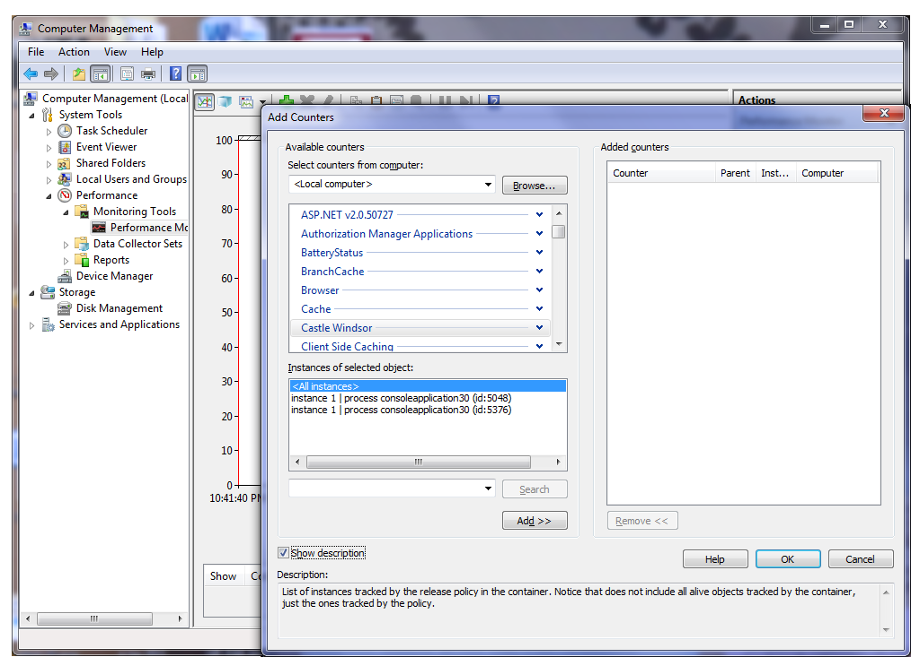
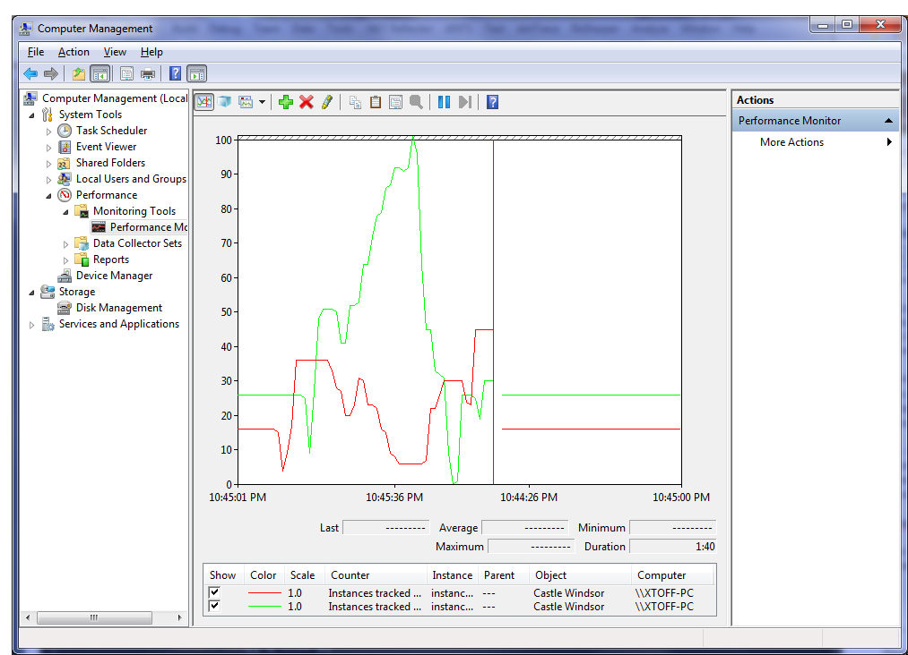

# Performance Counters

Windsor 3 introduced support for Windows performance counters.

Currently Windsor publishes just one counter - "Objects tracked by release policy", which shows you the total number of objects tracked by release policy of given container.

:information_source: **Hunting memory leaks:** This is a very useful feature, that will help you quickly validate if you have problems with non-releasing tracked component instances.

## Using Counters

This feature is not enabled by default. The following code shows how you can enable it:

```csharp
var container = new WindsorContainer();
var diagnostic = LifecycledComponentsReleasePolicy.GetTrackedComponentsDiagnostic(container.Kernel);
var counter = LifecycledComponentsReleasePolicy.GetTrackedComponentsPerformanceCounter(new PerformanceMetricsFactory());
container.Kernel.ReleasePolicy = new LifecycledComponentsReleasePolicy(diagnostic, counter);
```

Windsor will inspect if it has all required permissions, and if it does, it will ensure the right category and counters are created and will update the counter instances as the application(s) run. The created counter instances will exist for the lifetime of the process and will be removed when the process terminates.

:warning: **`Required permissions`:** If Windsor does not have permissions to create the counter category and counter objects (which require registry write permissions) it will silently continue without publishing counter instances, in this situation `LifecycledComponentsReleasePolicy.GetTrackedComponentsPerformanceCounter()` will return a `NullPerformanceCounter`. Run your application (or Visual Studio if debugging) elevated as administrator, you will only need to do this once.

In order to see the data open Performance Monitor (part of Computer Management console accessible from Administrative Tools section of your Windows Control Panel). Then click Add (Ctrl+N) and find "Castle Windsor" section. As noted above it will contain just one counter - "Objects tracked by release policy", and list of its instances.

List of instances of Windsor performance counter:



For example on the image above you can see there are two instances of the counter. Each of them comes from separate instance of the same application. After you select them you will be able to track, live, total number of all tracked component instances in each of the containers.

List of tracked instances in each container:


