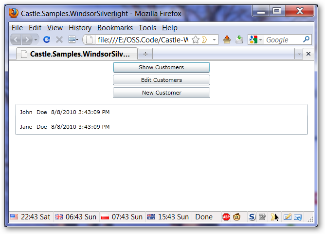
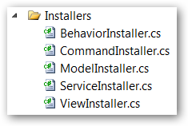

# Silverlight Sample App Customers Contact Manager

Customer Contact Manager is a simple sample application showcasing usage of Castle Windsor in Silverlight. This page will walk you through all the features of Windsor used by the application. You can download the code [here](http://github.com/HEskandari/Castle-Windsor-Examples).



:information_source: **Version:** The application uses Silverlight 4 and Windsor 2.5. If you want to download the entire source code, it uses Visual Studio 2010 solution.

## Bootstrapping - the guywire

The application uses a dedicated class, called `GuyWire` to implement the [Three Container calls pattern](three-calls-pattern.md). It does so via the following three methods:

* `Wire` which installs all the components using auto-discovery of [Installers](installers.md):

  `container.Install(FromAssembly.This());`

* `GetRoot` which obtains the root object of the application:

  `return container.Resolve<MainView>();`

* `Dewire` which tears down the container

  ```csharp
  if (container == null) return;
  container.Dispose();
  container = null;
  ```

:information_source: **Guywire pattern:** To read more about the guywire pattern see [this](http://fabiomaulo.blogspot.com/2009/11/guywire.html) and [this](http://jfromaniello.blogspot.com/2009/11/chinook-media-manager-guywire.html) blogpost.

## Container set up - installers



The application uses [Windsor Installers](installers.md) to encapsulate code responsible for registering components with the container. Each group of the components has dedicated installer type. All installers are contained in a dedicated project folder/namespace to cleanly separate them from the rest of the application.

For demonstration purposes each installer uses different pieces of API available to register the components.

### `BehaviorsInstaller`

Behaviors in the application are classes extending our model with additional capabilities. They are implemented as [DynamicProxy Interceptors](interceptors.md).

```csharp
container.Register(AllTypes.FromThisAssembly().BasedOn<IInterceptor>());
```

### `CommandInstaller`

Command installer installs commands which handle interactions with the user. Commands use [attributed registration](castlecomponentattribute.md).

```csharp
container.Register(AllTypes.FromThisAssembly()
    .Where(t => t.Namespace.EndsWith("Commands") && Component.IsCastleComponent(t))
);
```

### `ModelInstaller`

Model Installer registers model objects in our application (due to extreme simplicity of the app there's just one such class - `Customer`).

```csharp
container.Register(AllTypes.FromThisAssembly()
    .Where(Component.IsInSameNamespaceAs<Customer>())
    .Configure(c => c
        .LifeStyle.Transient
        .Proxy.AdditionalInterfaces(typeof(IEditableObject), typeof(INotifyPropertyChanged))
        .Interceptors(typeof(EditableBehavior), typeof(NotifyPropertyChangedBehavior))
    )
    .ConfigureFor<Customer>(c => c.DynamicParameters((k, @params) => @params.Insert(DateTime.Now)))
);
```

That's the most complicated installer in the application and there's quite a lot of stuff happening here so let's go over each step in turn

* line 3 - In addition to filtering (selecting which types to register and relying on defaults like in previous installers) we explicitly specify a [non-default lifestyle](lifestyles.md).
* line 4 and 5 - Additionally we specify two interfaces we want our model objects to implement - `IEditableObjects` and `INotifyPropertyChanged`. These are Silverlight interfaces that will give our model objects editability and notifications to/from the UI of changes property values.
* line 6 and 7 - To provide implementation for the interfaces we specify interceptors that will handle the task.
* lines 8 and 9 - in addition to above configuration that will be applied to all components matched by the filtering conditions, we specify additional fine-grained configuration just for `Customer` class - we specify typed [Dynamic parameter](inline-dependencies#supplying-dynamic-dependencies) for `DateTime` (we'll discuss why we do that when we cover `CustomersFactory` below).

### `ServiceInstaller`

Service installer registers application services. We have three of these - `ICustomerRepository`, `IModelFactory` and `CustomerFactory` delegate which is registered implicitly.

```csharp
container.AddFacility<TypedFactoryFacility>();
container.Register(
    Component.For<ICustomerRepository>()
        .ImplementedBy<CustomerRepository>()
        .DependsOn(Property.ForKey("serviceUri")
        .Eq("Fake service Uri for fake repository, but you get the idea")
    ),
    Component.For<IModelFactory>()
        .AsFactory()
);
```

We register [Typed Factory Facility](typed-factory-facility.md), so that we can use `IModelFactory` and `CustomerFactory` delegate as typed factories ([interface-based](typed-factory-facility-interface-based.md) and [delegate-based](typed-factory-facility-delegate-based.md) respectively). In addition we register [static named dependency](inline-dependencies#supplying-static-dependencies) for customer repository - serviceUri. In real application that would be address of our backend service. In .NET app we could pass connection string like this.

### `ViewInstaller`

View installer registers views in our application based on namespace

```csharp
container.Register(AllTypes.FromThisAssembly()
    .Where(Component.IsInNamespace("Castle.Samples.WindsorSilverlight.Views"))
);
```