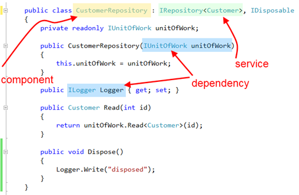

# Services and Components

Components, services and dependencies:



As every technology, Windsor has certain basic concepts that you need to understand in order to be able to properly use it. Fear not - they may have scary and complicated names and abstract definitions but they are quite simple to grasp.

## Service

:information_source: **Service in Windsor and WCF service:** The term service is extremely overloaded and has become even more so in recent years. Services as used in this documentation are a broader term than for example WCF services.

First concept that you'll see over and over in the documentation and in Windsor's API is **service**. Actual definition goes somewhat like this: "*service is an abstract contract describing some cohesive unit of functionality*".

Now in plain language, let's imagine you enter a coffee shop you've never been to. You talk to the barista, order your coffee, pay, wait and enjoy your cup of perfect Cappuccino. Now, let's look at the interactions you went through:

* specify the coffee you want
* pay
* get the coffee

They are the same for pretty much every coffee shop on the planet. They are the coffee shop service. Does it start making a bit more sense now? The coffee shop has clearly defined, cohesive functionality it exposes - it makes coffee. The contract is pretty abstract and high level. It doesn't concern itself with "implementation details"; what sort of coffee-machine and beans does the coffee shop have, how big it is, and what's the name of the barista, and color of her shirt. You, as a user don't care about those things, you only care about getting your cappuccino, so all the things that don't directly impact you getting your coffee do not belong as part of the service.

Hopefully you're getting a better picture of what it's all about, and what makes a good service. Now back in .NET land we might define a coffee shop as an interface (since interfaces are by definition abstract and have no implementation details you'll often find that your services will be defined as interfaces).

```csharp
public interface ICoffeeShop
{
   Future<Coffee> GetCoffee(CoffeeRequest request);
}
```

The actual details obviously can vary, but it has all the important aspects. The service defined by our `ICoffeeShop` is high level. It defines all the aspects required to successfully order a coffee, and yet it doesn't leak any details on who, how or where prepares the coffee.

If coffee is not your thing, you can find examples of good contracts in many areas of your codebase. `IController` in ASP.NET MVC, which defines all the details required by ASP.NET MVC framework to successfully plug your controller into its processing pipeline, yet gives you all the flexibility you need to implement the controller, whether you're building a social networking site, or e-commerce application.

If that's all clear and simple now, let's move to the next important concept.

## Component

Component is related to service. Service is an abstract term and we're dealing with concrete, real world. A coffee shop as a concept won't make your coffee. For that you need an actual coffee shop that puts that concept in action. In C# terms this usually means a class implementing the service will be involved.

```csharp
public class Starbucks: ICoffeeShop
{
   public Future<Coffee> GetCoffee(CoffeeRequest request)
   {
      // some implementation
   }
}
```

So far so good. Now the important thing to remember is that, just as there can be more than one coffee shop in town, there can be multiple components, implemented by multiple classes in your application (a Starbucks, and a CofeeClub for example).

It doesn't end there! If there can be more than one Starbucks in town, there can also be more than one component backed by the same class. If you've used NHibernate, in an application accessing multiple databases, you probably had two session factories, one for each database. They are both implemented by the same class, they both expose the same service, yet they are two separate components (having different connection strings, they map different classes, or potentially one is talking to Oracle while the other to SQL Server).

It doesn't end there (still)! Who said that your local French coffee shop can only sell coffee? How about a tarte or fresh baguette to go with the coffee? Just like in real life a coffee shop can serve other purposes a single component can expose multiple services.

One more thing before we move forward. While not implicitly stated so far it's probably obvious to you by now that a component provides a service (or a few). As such all the classes in your application that do not really provide any services will not end up as components in your container. Domain model classes, DTOs are just a few examples of things you will not put in a container.

## Dependency

We're almost there. To get the full picture we need to talk about dependencies first.

A component working to fulfill its service is not living in a vacuum. Just like a coffee shop depends on services provided by utility companies (electricity), its suppliers (to get the beans, milk etc) most components will end up delegating non-essential aspects of what they're doing to others.

Now let me repeat one thing just to make sure it's obvious. Components depend on services of other components. This allows for nicely decoupled code where your coffee shop is not burdened with details of how the milk delivery guy operates.

In addition to depending on other component's services your components will also sometimes use things that are not components themselves. Things like connectionStrings, names of servers, values of timeouts and other configuration parameters are not services (as we discussed previously) yet are valid (and common) dependencies of a component.

In C# terms your component will declare what dependencies it requires usually via constructor arguments or settable properties. In some more advanced scenarios dependencies of a component may have nothing to do with the class you used as implementation (remember, the concept of a component is not the same as a class that might be used as its implementation), for example when you're applying interceptors. This is advanced stuff however so you don't have to concern yourself with it if you're just starting out.

## Putting it all together

So now lets put it all together. To effectively use a container we're dealing with small components, exposing small, well defined, abstract services, depending on services provided by other components, and on some configuration values to fulfil contracts of their services.

You will end up having many small, decoupled components, which will allow you to rapidly change and evolve your application limiting the scope of changes, but the downside of that is you'll end up having plenty small classes with multiple dependencies that someone will have to manage.

That is the job of a container.