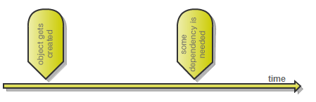

# Typed Factory Facility - interface-based factories

Interface-based typed factories are extremely useful in following situation:

Object needs dependency provided after it was created:



An example of a component like that would be a message dispatcher which waits for a message to arrive, then when that happens it pulls appropriate message handler and delegates the handling of the message to it. Using a typed factory the dispatcher can easily pull message handlers from the container, without having to explicitly use it. This gives you full power of the container and keeps your code expressive and free from service location.

## Registering factories

Once you have created a factory interface:

```csharp
public interface IDummyComponentFactory
{
     IDummyComponent Create();
     void Release(IDummyComponent dummyComponent);
}
```

you can then register this with the Windsor framework using the extension method `AsFactory`:

```csharp
kernel.AddFacility<TypedFactoryFacility>();
kernel.Register(
    Component.For<IDummyComponentFactory>()
        .AsFactory()
);
```

(This requires the namespace `Castle.Facilities.TypedFactory`)

:information_source: **That's right - no implementation:** Notice we specify an interface and don't provide any implementation. By using `AsFactory` extension method we're telling Windsor to provide its own implementation that adheres to the default convention for typed factories (discussed below)

## Factory requirements

Not just any type may be used as typed factory. The following requirements must be met:

* The type must be an interface
* None of its methods can have out parameters.

## Using typed factories

You use of typed factories much like you would use any other service. There are three kinds of methods it treats specially:

* methods with no return value (having 'void' as return type)
* methods with return value (having something different than 'void' as return type)
* `Dispose` method (if typed factory implements `IDisposable`)

:warning: **Lifetime and releasing components:** Remember that by default all components in Windsor are singletons and that using default release policy container keeps reference to all components, even transient ones. That's why it's important to release components via typed factory. Also pay attention to lifetime you assign to components resolved via the facility.

We will now go over them in turn.

### Resolving methods

Methods with non-void return type are used for supplying components to the caller. Say we register a component and a factory that will be used to create it.

```csharp
kernel.Register(
    Component.For<IDummyComponent>()
        .ImplementedBy<Component2>()
        .Named("SecondComponent")
        .LifeStyle.Transient,
    Component.For<IDummyComponentFactory>()
        .AsFactory());
```

now we can resolve the factory:

```csharp
var factory = kernel.Resolve<IDummyComponentFactory>();
```

and someplace else in the code we can use the factory to give us the component we need

```csharp
var component = factory.GetSecondComponent();
```

### Resolving with arguments

You can also use methods that take parameters from the caller to resolve components. The argument you pass in, will be passed on to the container's resolution pipeline.

```csharp
kernel.Register(
    Component.For<ICalendarFactory>().AsFactory(),
    Component.For<ICalendar>().ImplementedBy<Calendar>().LifeStyle.Transient
);
```

Now you can resolve the factory

```csharp
var calendarFactory = kernel.Resolve<ICalendarFactory>();
```

And use it passing some arguments in.

```csharp
var today = DateTime.Today;
var calendar = calendarFactory.CreateCalendar(today);
Debug.Assert(calendar.Today == today);
```

:information_source: **How arguments are bound:** Specifics about how method being invoked and its arguments are bound to resolved component are determined by an implementation of `ITypedFactoryComponentSelector` interface. By default the facility uses `DefaultTypedFactoryComponentSelector` (discussed below) but you can supply your own to customize its behavior.

## Releasing methods

Windsor always tracks disposable non-singleton components resolved via typed factory. That means that if you resolve a component from the container you should also release it as soon as you're done using it, to allow Garbage Collector to reclaim memory and resources occupied by it. How do you do it when you're using Typed Factory? With Releasing methods.

Releasing methods are counterparts to Resolving methods. They release components resolved by the latter. Any "`void` method" other than `Dispose` is a releasing method (actually `Dispose` is a releasing method as well, just a very special one). It tries to release all objects passed to them as parameters.

### Releasing example

Given you resolved a component from a typed factory:

```csharp
var component = factory.Create();
```

You can then pass it as an argument to any of factory's void methods to have the factory release the component from the container

```csharp
factory.Destroy(component);
```

You can also pass more components at once, and the facility will release them in turn.

:information_source: **Releasing the factory releases all components:** Typed factory (both `interface` and `delegate`-based) *owns* the components you resolve through it. That means that when you release the factory, all the components you resolved from the factory will be released as well.

## `Dispose`

When your typed factory interface implements `IDisposable` it gains a powerful ability - disposing the factory releases all components created via the typed factory

```csharp
var factory = kernel.Resolve<IDisposableFactory>();
var component = factory.Create();
Debug.Assert(component.Disposed == false);
```

Now you can dispose the factory, and all non-singleton components will be released as well.

```csharp
factory.Dispose();
Debug.Assert(component.Disposed == true);
```

## Mapping calls to typed factory to kernel's arguments

Typed Factory Facility uses implementation of `ITypedFactoryComponentSelector` interface to decide how information it received from the factory (factory Resolving method and its arguments) should be mapped to information forwaded to the container to perform actual resolution of the component. The facility comes with one implementation: `DefaultTypedFactoryComponentSelector` but if you need custom behavior you can supply your own.

### `DefaultTypedFactoryComponentSelector`

`DefaultTypedFactoryComponentSelector` obeys few conventions:

#### 'Collection' methods resolve multiple components

When you have a factory method with one of the following return types:

* `IFoo[][]`
* `IEnumerable<IFoo>`
* `ICollection<IFoo>`
* `IList<IFoo>`

The factory will recognize that you want a collection, not a single component and it will return collection of all components for service `IFoo` rather than single component.

For example, given the factory interface:

```csharp
public interface IMessageHandlersFactory
{
    IMessageHandler[] GetAllHandlersForMessage(IMessage message);
}
```

calling the method:

```csharp
var handlers = factory.GetAllHandlersForMessage(new HelloWorldMessage());
```

is direct equivalent of calling:

```csharp
var handlers = container.ResolveAll<IMessageHandler>(new { message = new HelloWorldMessage()});
```

#### 'Get' methods lookup components by name

When you have a factory method named `GetSomething`, selector will ask the container for a service named `Something`.

```csharp
kernel.Register(
    Component.For<IDummyComponent>()
        .ImplementedBy<Component2>()
        .Named("SecondComponent")
        .LifeStyle.Transient
);
```

Now if we have a method called `GetSecondComponent`:

```csharp
var component = factory.GetSecondComponent();
```

Call to the factory's method is direct equivalent of calling:

```csharp
var component = kernel.Resolve<IDummyComponent>("SecondComponent");
```

When no such component is registered, typed factory will fallback to default behavior of non-'Get' methods.

#### non-'Get' methods lookup by type

For all other methods, the return type of the method is used as type of component to look-up, so call to factory method:

```csharp
var component = factory.CreateSecondComponent();
```

is direct equivalent of calling: (assuiming `IDummyComponent` is the return type of the method)

```csharp
var component = kernel.Resolve<IDummyComponent>();
```

#### Method parameters are forwarded to the caller by name

When factory method has parameters, their names and values are forwarded to the kernel, so call to the following typed factory method:

```csharp
IComponent CreateComponent(string componentName, int someParameter);
var component = factory.CreateComponent("foo", 3);
```

is direct equivalent of calling:

```
var component = kernel.Resolve<IComponent>(new Dictionary<string, object>`"componentName", "foo"}, {"someParameter", 3`);
```

### Custom `ITypedFactoryComponentSelector`s

:information_source: **Utilize `DefaultTypedFactoryComponentSelector`:** When creating your custom `ITypedFactoryComponentSelector` consider inheriting `DefaultTypedFactoryComponentSelector` instead of implementing the interface directly. `DefaultTypedFactoryComponentSelector` is designed with extensibility in mind, so chances are, overriding single virtual method with few lines of code will get you what you need.

This custom implementation resolve component by id when a method with the following signature is called on the factory:

```csharp
factory.GetById(string)
```

Here is the implementation:

```csharp
public class CustomTypedFactoryComponentSelector : DefaultTypedFactoryComponentSelector
{
    protected override string GetComponentName(MethodInfo method, object[] arguments)
    {
        if (method.Name == "GetById" && arguments.Length == 1 && arguments[0] is string)
        {
            return (string)arguments[0];
        }
        return base.GetComponentName(method, arguments);
    }
}
```

And the configuration:

```csharp
var ioc = new WindsorContainer();
ioc.AddFacility<TypedFactoryFacility>();
ioc.Register(Component.For<ITypedFactoryComponentSelector>().ImplementedBy<CustomTypedFactoryComponentSelector>());
```

### Registering factories with custom `ITypedFactoryComponentSelector`

The facility will use default `ITypedFactoryComponentSelector` unless you explicitly override it for your factories (on a one-by-one basis).

You can specify the selector explicitly in three ways:

#### Specifying custom selector as instance

If you don't want to register the selector as a service in your container, you can explicitly provide an instace.

```csharp
container.Register(
	 Component.For<DummyComponentFactory>().AsFactory(c => c.SelectedWith(new MyCustomSelector()))
);
```

This is useful in one-case scenario where you want to use a non-default selector for a single factory among many.

#### Specifying custom selector by type

When your selector is registered as a service in the container, you can specify it by type

```csharp
container.Register(
  	Component.For<DummyComponentFactory>().AsFactory(c => c.SelectedWith<MyComponentSelector>()),
  	Component.For<MyComponentSelector, ITypedFactoryComponentSelector>()
);
```

#### Specifying custom selector by name

When your selector is registered as a service in the container, you can specify it by name as well.

```csharp
container.Register(
    Component.For<DummyComponentFactory>().AsFactory(c => c.SelectedWith("factoryTwo")),
    Component.For<ITypedFactoryComponentSelector>().ImplementedBy<MyComponentSelector>().Named("factoryOne")
);
```

## XML configuration

In addition to code the facility exposes also XML configuration.

```xml
<configuration>
   <facilities>
      <facility
         id="typedFactory"
         type="Castle.Facilities.TypedFactory.TypedFactoryFacility, Castle.Windsor">
         <factories>
            <factory id="handlerFactory"
               interface="Acme.Crm.IHandlerFactory, Acme.Crm" selector="${mySelectorComponent}" />
            <factory id="repositoryFactory"
               interface="Acme.Crm.IRepositoryFactory, Acme.Crm" />
         </factories>
      </facility>
   </facilities>
</configuration>
```

:information_source: **Configuration goes first:** When using XML configuration the configuration must be installed before you add the facility to the container. Otherwise the facility will not read the configuration.

## See also

* [Typed Factory Facility](typed-factory-facility.md)