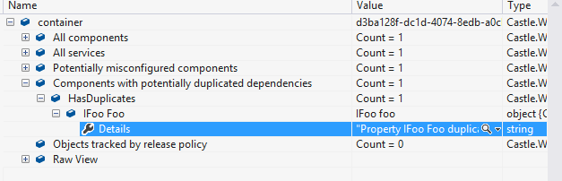

# What's new in Windsor 3.2

Windsor 3.2 is a minor update over version 3.0/3.1. It does contain a set of new features and fixes that make it a worthwhile update. Below is a (non-comprehensive) list of highlights of the release.

:information_source: For more details see `CHANGELOG.md` and `breakingchanges.txt` files distributed as part of the package)

## .NET 4.5 and Silverlight 5 support

Windsor 3.2 adds .NET 4.5 and Silverlight 5 build. It is also the last version to support Silverlight and .NET 3.5.

## Improvements to *bound* lifestyle

Bound lifestyle now allows you to bind to the nearest matched component in the graph, not just the first found.


For the graph of component dependencies above, the following registration of repository will result in `WelcomeScreenViewModel` and most of its sub-graph sharing one instance of the repository, but the subgraphs that are viewmodels themselves (like `MenuViewModel` will have their own, new instance.

```csharp
Container.Register(
   Component.For<Repository>().LifestyleBoundToNearest<IViewModel>());
```

## *Components with potentially duplicated dependencies* diagnostic

A new diagnostic has been added to the container detecting duplicated dependencies. Basically for components like

```csharp
public class HasDuplicates
{
	public HasDuplicates(IFoo foo)
	{
		Foo = foo;
	}

	public IFoo Foo { get; set; }
}
```

With default registration this component will appear to be exposing two dependencies (one via constructor, another via the property). However in reality this is a single dependency, as the constructor already sets the property.

Windsor treats them as two dependencies and will try to satisfy both. The new diagnostic scans for situations like that.



Removing those duplicates will make Windsor's life easier (it won't have to do the work twice) and will help you avoid potentially tricky problems.

## Diagnostic logging in the container

The container now internally does some logging to help you gain better insight into what's happening in the container. Also if you're extending the container, you can access the logger yourself and log information from your extensions.

By default Windsor will log with TraceLogger (the messages can be seen in Visual Studio Output Window) but you can change it to any other logger.

```csharp
var container = new WindsorContainer();
((IKernelInternal)container.Kernel).Logger = new ConsoleLogger();
```

The type of information currently being logged includes:

* When Windsor tries to resolve an optional dependency, but fails due to an exception, the exception is logged.
* When registering a type by convention and ignoring it due to an existing registration for that type, this fact is logged.

## Revamped property filtering API. **breaking change**

Windsor 3.1 added ability to control which properties on the type to expose as dependencies, which to ignore, and which to make mandatory. However the API was confusing and broken. Therefore in Windsor 3.2 some parts of the API became obsolete, and clearer (and not broken) methods were introduced.

:warning: **Obsolete API:** The `.Properties` overloads that take `Predicate<PropertyInfo>` are now obsolete. It is strongly advised to migrate their usage to one of the other methods.

Those methods will be removed in Windsor 4}

```csharp
container.Register(
	Component.For<MainViewModel>()
			 .Properties(PropertyFilter.IgnoreBase)
			 .PropertiesIgnore(p => p.PropertyType.Is<ICommand>())
			 .PropertiesRequire(p => p.PropertyType == typeof(IBus)));
```

In addition to the overload taking `PropertyFilter` enum value, we now have two methods: `PropertiesIgnore` and `PropertiesRequire` that clearly indicate what happens to the properties matched by their respective predicates. In addition to the one shown in the example, another overload to each of them exists, that takes the `ComponentModel` in addition to `PropertyInfo` for use in more advanced scenarios.

:information_source: **First match wins:** As is the case elsewhere in Windsor, when multiple property filtering rules match a single property the first one wins. So in this example even if the base type of `MainViewModel` had a property of type `IBus` it would be ignored because the first rule specified all base properties are ignored, and the rule requiring `IBus` comes after. The outcome would be different if we swapped the calls around

## Multiple `BasedOn` in a single registration

Sometimes it makes sense to register two groups of components at once.

```csharp
Container.Register(
   Classes.FromThisAssembly()
          .BasedOn<IFoo>()
          .OrBasedOn(typeof(IBar))
          .WithServiceBase()
	  .LifestyleTransient());
```

It is now possible to follow a `BasedOn` call with one or more `OrBasedOn` calls. The registration above will find all types that implement either `IFoo` or `IBar` and then register each of them with the appropriate interface as the service.

:information_source: **Types implementing both interfaces:** If you have a type like the following

```csharp
public class FooBar: IFoo, IBar
{
   // stuff
}
```

The registration above will register the component for `FooBar` as exposing both `IFoo` and `IBar` as services.}

## Dependency on embedded resource

A helper method was added to easily specify a dependency on a value coming from an embedded resource. This is useful for example when specifying dependencies on translatable strings.

```csharp
Container.Register(
   Component.For<MainViewModel>()
            .DependsOn(Dependency.OnResource<Resources>("title", "MainWindowTitle")));
```

Notice the call uses `Resources` class, generated by VIsual Studio when using resources. Alternative overload takes a `ResourceManager` instance instead.

## Filtering constructors with `DoNotSelectAttribute`

In some rare cases you might want Windsor to ignore the greediest constructor on your component, similarily to how `DoNotWireAttribute` ignores properties. A `DoNotSelectAttribute` has been added to do just that.

```csharp
public class MyComponent
{
   public MyComponent() { }

   [DoNotSelect] // this constructor will be completely ignored
   public MyComponent(IFoo foo)
   {
      Foo = foo;
   }

   public IFoo Foo {get; private set;}
}
```

## See also

* [What's new in Windsor 3.1](whats-new-3.1.md)
